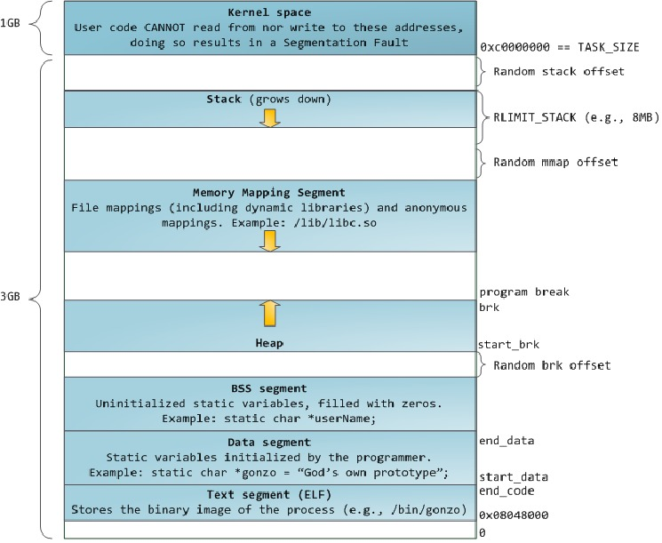
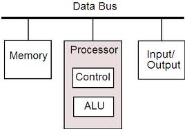
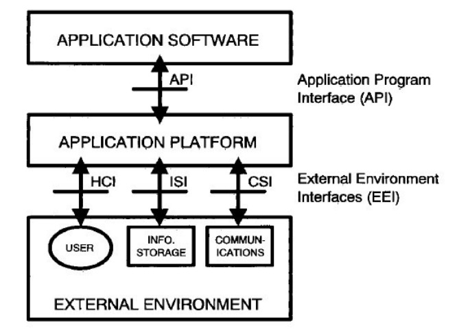

## ОС

ОС - це комплекс керуючих і обробляючих програм, які, з одного боку, виступають як інтерфейс між пристроями обчислювальної системи і прикладними програмами, а з іншого боку - призначені для управління пристроями і обчислювальними процесами, ефективного розподілу ресурсів між обчислювальними процесами і організації надійних обчислень.

![Місце ОС] (img/os-place.jpg)

### Завдання ОС:

- Управління апаратною частиною (менеджер ресурсів)
- Абстракція апаратної частини (віртуальна машина)
- Ізоляція додатків від апаратної частини (щоб уникнути псування)

## Програма в пам'яті

### Програма Hello World:

    #include <stdio.h>
    #include <unistd.h>

    int main ()
    {
        printf("Hello World");
        exit(0);
    }

### Один з варіантів дизасемблювання:

    .section .rodata
    .LC0:
        .string “Hello World”

    .text
    .globl  main
    .type   main,@function
    main:
        pushl    %ebp
        movl     %esp, %ebp
        subl     $8, %esp
        subl     $12, %esp
        pushl    $.LC0
        call     printf
        addl     $16, %esp
        subl     $12, %esp
        pushl    $0
        call     exit

## Ядро ОС

Ядро ОС - це центральна частина операційної системи, що забезпечує додаткам координований доступ до ресурсів комп'ютера, таким як процесорний час, пам'ять, зовнішнє апаратне забезпечення, зовнішній пристрій введення і виведення інформації. Також зазвичай ядро ​​надає сервіси файлової системи і мережевих протоколів.

Ядро - теж програма.

### Варіанти реалізації ядра:

- Монолітне: одна монолітна програма в пам'яті - +простота, +швидкість, -помилки, -перекомпіляція
- Модульне: монолітна програма, що надає інтерфейс завантаження і вивантаження модулів - знімає проблему перекомпіляції
- Мікроядро: кілька програм, які взаємодіють через передачу повідомлень - +ізоляція, +слабка зв'язність, -складність, -швидкість
- Наноядро: ядро тільки управляє ресурсами (обробка переривань)
- Екзоядро: наноядро з координацією роботи процесів
- Гібридне

![Ядро Linux, http://www.makelinux.net/kernel_map/] (img/linux-kernel.jpg)

## Апаратна архітектура

### Різні архітектури:

- Фон Неймана
- Гарвардська
- Стекові машини
- Lisp Machine
- FPGA
- та інші

### Архітектура фон Неймана

### Принципи фон Неймана:

- Двійкове кодування

    Згідно з цим принципом, вся інформація, що надходить в ЕОМ, кодується за допомогою двійкових сигналів (двійкових цифр, бітів) і розділяється на одиниці, звані словами.

- Однорідність пам'яті

	Програми та дані зберігаються в одній і тій же пам'яті. Тому ЕОМ не розрізняє, що зберігається в даній комірці пам'яті - число, текст або команда. Над командами можна виконувати такі ж дії, як і над даними.

- Адресованість пам'яті

	Структурно основна пам'ять складається з пронумерованих осередків; процесору в довільний момент часу доступний будь-який осередок. Звідси випливає можливість давати імена областям пам'яті, так, щоб до значень, які в них знаходяться, можна було б згодом звертатися або міняти їх в процесі виконання програми з використанням привласнених імен.

- Послідовного програмного керування

	Програма складається з набору команд, які виконуються процесором автоматично один за одним у певній послідовності.

- Жорсткості архітектури

	Незмінюваність в процесі роботи топології, архітектури, списку команд.

### Von Neumann Bottleneck:

Спільне використання шини для пам'яті програм і пам'яті даних
призводить до появи вузького місця архітектури фон Неймана, а саме
обмеження пропускної спроможності каналу між процесором і пам'яттю в
порівнянні з об'ємом пам'яті. Через те, що пам'ять програм і пам'ять
даних не можуть бути доступні в один і той же час, пропускна здатність
є значно меншою, ніж швидкість, з якою процесор може працювати. Це
серйозно обмежує ефективну швидкодію при використанні процесорів,
необхідних для виконання мінімальної обробки на великих обсягах
даних. Процесор постійно змушений чекати необхідних даних, які будуть
передані в пам'ять або з пам'яті. Так як швидкість процесора і об'єм
пам'яті збільшувалися набагато швидше, ніж пропускна здатність між
ними, вузьке місце стало великою проблемою, серйозність якої зростає з
кожним новим поколінням процесорів.

## Архітектура x86

<http://en.wikibooks.org/wiki/X86_Assembly/X86_Architecture>

### Основні особливості:

- Набір інструкцій процесора (CICS), інструкції двох типів: арифметико-логічні (ADD, AND, ...) і керуючі (MOV, JMP, ...)
- Обмежена кількість регістрів: кілька регістрів загального призначення (A, B, C, D), розмір яких дорівнює довжині машинного слова, і кілька спеціальних регістрів (IP, FLAGS, ...). АЛП процесора може працювати тільки з регістрами загального призначення. ПУ процесора займається модифікацією значень регістрів або переміщенням даних між регістрами й пам'яттю

### Режими роботи процесора:

- Реальний: пряма адресація пам'яті
- Захищений: непряма адресація пам'яті з використанням модуля управління пам'яттю (MMU)
- та інші допоміжні

### Робота процесора:

    while (1) {
        execute_instruction(read_memory(IP));
        // IP - регістр-вказівник інструкції
    }

## Віртуальна машина

Віртуальна машина - це (ефективний) ізольований дуплікат реальної машини.

[Критерії ефективної віртуалізації Попека-Голдберга](http://en.wikipedia.org/wiki/Popek_and_Goldberg_virtualization_requirements)

### Можливі завдання:

- Емуляція різних архітектур
- Реалізація мови програмування
- Збільшення переносності коду
- Дослідження продуктивності ПЗ або нової комп'ютерної архітектури
- Оптимізації використання ресурсів комп'ютерів
- Захист інформації та обмеження можливостей програм (пісочниця)
- Інфільтрація шкідливого коду для управління інфікованою системою
- Моделювання інформаційних систем різних архітектур на одному комп’ютері
- Спрощення адміністрування

### Типи:

- Системна (гіпервізор)
- Процесна

### Типи гіпервізорів:

- Автономний
- На основі базової ОС
- Гібридний

## POSIX

POSIX - Portable Operating System Interface for Unix - Переносний інтерфейс операційних систем Unix - набір стандартів, що описують інтерфейси між операційною системою і прикладною програмою.

Відкриті стандарти - це стандарти, які публікуються у відкритих джерелах і, як правило, мають одну або кілька (часто обов'язковою є наявність мінімум двох) еталонних реалізацій (reference implementation). Також, як правило, такі стандарти розробляються в рамках чітко визначеного процесу.

Інтерфейс - сукупність правил (описів, домовленостей, протоколів), що забезпечують взаємодію пристроїв і програм в обчислювальній системі або сполучення між системами. Це зовнішнє подання, абстракція якогось інформаційного об'єкта. Інтерфейс розділяє методи зовнішньої взаємодії і внутрішньої роботи. Один об'єкт може мати декілька інтерфейсів для різних "споживачів". Інтерфейс - це засіб трансляції між сутностями зовнішньої і внутрішньої для об'єкта середовища. Інтерфейс - це форма непрямої взаємодії. Пов'язаний з концепцією кібернетики "чорний ящик".

Протокол - набір домовленостей інтерфейсу логічного рівня, які визначають обмін даними між різними програмами. Ці домовленості задають однаковий спосіб передачі повідомлень і обробки помилок при взаємодії програмного забезпечення рознесеної в просторі апаратури, з'єднаної тим чи іншим інтерфейсом. Це набір правил взаємодії між об'єктами. Ці правила визначають синтаксис, семантику і синхронізацію взаємодії. Протокол може існувати у формі конвенції (неформального набору правил) або стандарту (формального).

### Завдання POSIX:

- Сприяти полегшенню перенесення коду прикладних програм на інші платформи
- Сприяти визначенню та уніфікації інтерфейсів заздалегідь при проектуванні, а не в процесі їх реалізації
- За можливості зберегти і враховувати усі головні, створені раніше і використовувані прикладні програми
- Визначати необхідний мінімум інтерфейсів прикладних програм, для прискорення створення, схвалення і затвердження документів
- Розвивати стандарти в напрямку забезпечення комунікаційних мереж, розподіленої обробки даних і захисту інформації
- Рекомендувати обмеження використання бінарного (об'єктного) коду для додатків в простих системах

### Принципи відкритої системи:

- Переносимість додатків (на рівнях: коду і програми), даних і персоналу
- Взаємодійність (interoperability)
- Розширюваність
- Масштабованість

## Фольклор

Системне програмування - одна з найстаріших областей комп'ютерної інженерії. Тому вона включає в себе не тільки формальні знання, такі як алгоритми, стандарти і результати досліджень, але також і накопичені неформальні, культурні та соціальні знання.

### Приклади:

- Закон Постела (принцип здоровості) - відноситься до організації взаємодії між системами. Один з принципів, що лежать в основі Інтернету

	> Будьте консервативні в тому, що відправляєте, і ліберальні в тому, що приймаєте.

- Закон конвертації програм Завінського - описує розвиток будь-якої складної програмної системи

	> Кожна програма намагається розширитися до тих пір, поки не зможе читати пошту. Ті програми, які не можуть цього зробити, замінюються тими, які можуть.

- Десяте правило програмування Грінспена - описує розвиток будь-якої складної програмної системи на основі статичних мов

	> Будь-яка достатньо складна програма на C або Fortran містить реалізацію половини Common Lisp, яка є ad hoc, неформально-специфікованою, повною вад і повільною.

## Література

- [A Crash Course in Modern Hardware](http://www.infoq.com/presentations/click-crash-course-modern-hardware)
- [The C Programming Language](https://hassanolity.files.wordpress.com/2013/11/the_c_programming_language_2.pdf) або [Learn C The Hard Way](http://c.learncodethehardway.org/book/)
- [The Unix Programming Environment](https://bin.sc/Teaching/2014/JavaScript/Resources/The%20Unix%20Programming%20Environment.pdf)
- [Tanenbaum–Torvalds debate](http://en.wikipedia.org/wiki/Tanenbaum%E2%80%93Torvalds_debate)
