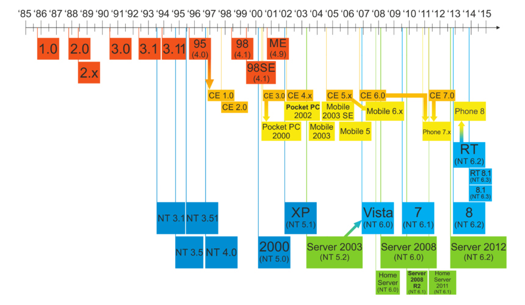

## История Windows

Windows — это семейство ОС, которое развивалось постепенно, начиная с переделки ОС CP/M в ОС MS-DOS. MS-DOS, как и CP/M, был примитивной однопользовательской ОС для только появлявшихся персональных компьютеров. Он был создан в рамках существующих на тот момент аппаратных ограничений этих устройств (16-битная архитектура, малые доступные ресурсы, такие как мощность процессора, объемы памяти и постоянных хранилищ). Изначально эта система должна была загружаться с дискет емкостью порядка 750 Кб, работать в текстовом графическом режиме и управлять памятью до 1 МБ. Система Windows изначально была графической оболочкой поверх MS-DOS.

Вместе с быстрым развитием возможностей ПК начала быстро развиваться и Windows, вскоре упершись в ограничения своей архитектуры. Windows 95/98 стала 32-разрядной версий системы, которая еще не использовала такие стандартные технологии поддержки многопользовательской работы, как разделение на режим ядра и пользователя, вытесняющую многозадачность, ФС с разделением прав доступа и т.п.

Реализацией современных концепций ОС стало ядро Windows NT, которое послужило основой систем Windows 2000/XP/7/8 и Windows Server. 

## Windows NT

Windows NT — это название современного ядра Windows.

Его основные характеристики:

- разделение на режим ядра и пользователя
- гибридное ядро, включающее микроядро, уровень абстракции устройств и драйверов (HAL) и сервисы ОС, работающие в ядерном режиме (Executive), а также сервисы ОС, работающие в пользовательском режиме: окружение (Environment) и интеграции (Integral)
- поддержка вытесняющей многозадачности
- поддержка SMT/SMP
- ввод-вывод на основе пакетного и асинхронного режимов

Микроядро выполняет следующие функции:

- синхронизация
- планирование выполнения нитей и обработки прерываний
- перехват исключений
- инициализацию драйверов при запуске системы

Исполнительные сервисы ОС (Executive) включают:

- ввод-вывод (в т.ч. взаимодействие с графическими устройствами через интерфейс GDI)
- управление устройствами (в т.ч. питанием, поддержка Plug-n-play утсройств) 
- управление объектами ядерного режима
- управление процессами и межпроцессорным взаимодействием
- управление памятью и кешами
- управление конфигурацией (через системный реестр)
- безопасность

Сервисы окружения ядра WinNT поддерживают 3 режима работы:

- Win32-совместимый (с поддержкой MSDOS и Win16 приложений), включающий также оконный менеджер - сервис csrss.exe
- Posix-совместимый
- OS/2-совместимый

## Ключевые решения Windows

- привязка к архитектуре x86 (Windows не поддерживает других архитектур, помимо ARM)
- GUI-центричность
- Windows API
- Управление конфигурацией через реестр
- Большое внимание обратной совместимости
- Системный язык C++, затем C#

## Критика Windows

- закрытая система
- проблемы с композицией програм
- проблемы с безопасностью
- непригодность для многих сценариев работы (прежде всего, как высокопроизводительной серверной ОС)

## Литература

- [Mark Russinovich & David Solomon - Windows Internals](http://technet.microsoft.com/en-us/sysinternals/bb963901.aspx)
- [The Infamous Windows “Hello World” Program](http://www.charlespetzold.com/blog/2014/12/The-Infamous-Windows-Hello-World-Program.html)
- [MS-DOS: A Brief Introduction](http://www.linfo.org/ms-dos.html)
- [How Microsoft Lost the API War](http://www.joelonsoftware.com/articles/APIWar.html)
