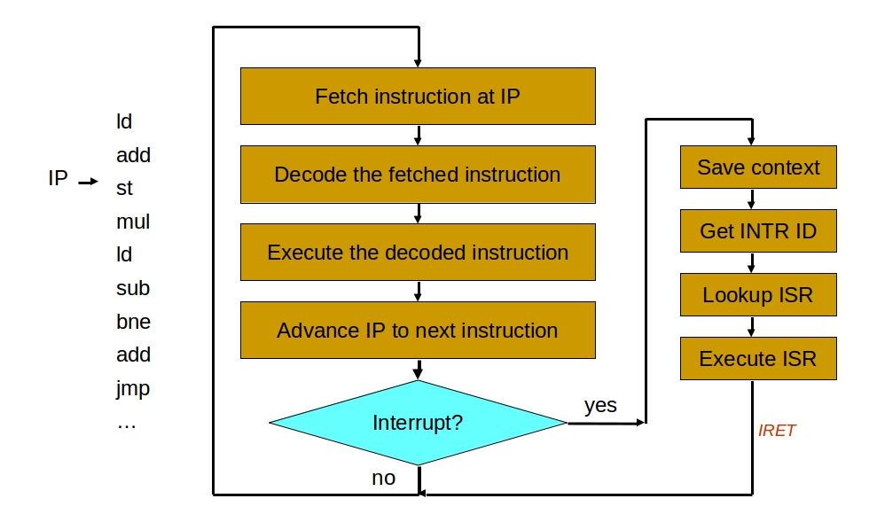
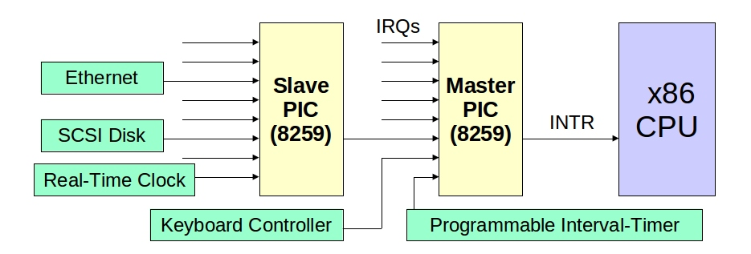
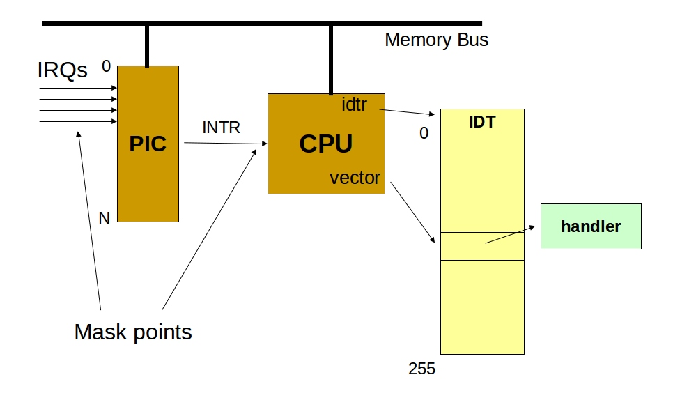
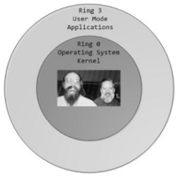
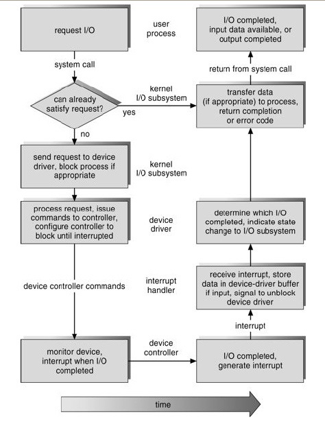
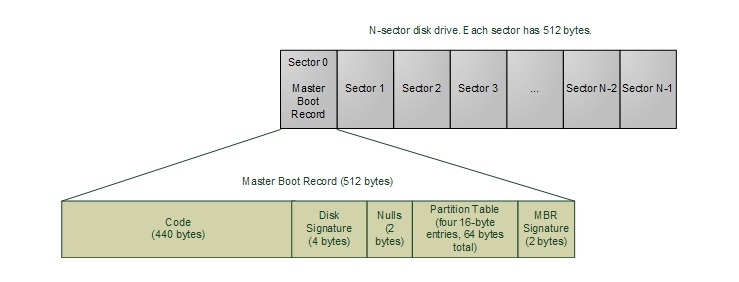
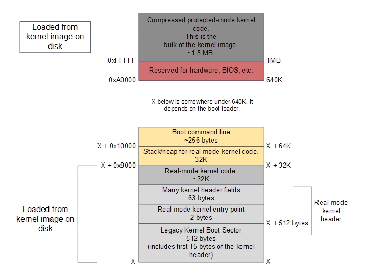

## Обзор работы ОС с аппаратной частью

ОС реализуется поверх аппаратной архитектуры, которая определяет способ взаимодействия и набор ограничений. Взаимодействие происходит напрямую — через выдачу инструкций процессору,— и косвенно — через обработку прерываний устройств. С момента начала загрузки ОС указатель на текущую инструкцию процессора (регистр IP) устанавливается в начальную инструкцию исполняемого кода ОС, после чего управление работой процессора переходит к ОС. 

Взаимодействие процессора с внешними устройствами (также называемое вводом-выводом) возможно только через адресуемую память. Существуют 2 схемы передачи данных между памятью и устройствами: PIO (Programmed IO — ввод-вывод через процессор) и DMA (Direct Memory Access — прямой доступ к памяти). В основном используется второй вариант, который полагается на отдельный контроллер, что позволяет разгрузить процессор от управления вводом-выводом и таким образом ускорить работу системы в целом.

### Драйверы устройств

Драйвер устройства — это компьютерная программа, которая реализует механизм управления устройством и позволяет программам более высокого уровня взаимодействовать с конкретным устройством, не зная его команд и других параметров функционирования. Драйвер осуществляет свои функции посредством команд контроллера устройства и обработки прерываний, приходящих от него. Как правило, драйвер реализуется как часть (модуль) ядра ОС, т.к.:

- обработка прерываний драйвером требует задействования функций ОС
- справедливая и эффективная утилизация устройства требует участия ОС
- посылка неверных команд или их последовательностей, а также несоблюдение других условий работы с устройством может вывести его из строя

Драйверы устройств деляться на 3 основных класса:

- Символьные — работают с устройствами, позволяющими передавать данные по 1 символу (байту): как правило, различные консоли, модемы и т.п.
- Блочные — работают с устройствами, позволяющими осуществлять буферизированный ввод-вывод: например, различными дисковыми накопителями
- Сетевые

Драйверы отдельных устройств объединяются ОС в классы, которые предоставляют единообразный абстрактный интерфейс программам более высокого уровня. В общем этот интерфейс называется Уровнем абстракции оборудования (Hardware absctraction layer, HAL).

### Время в компьютере

Для работы ОС использует аппаратный таймер, который работает на заданной тактовой частоте (на данный момент, как правило 100 Гц). В Linux 1 цикл такого таймера называется `jiffies`. При этом современные процессоры работают на тактовой частоте порядка ГГц, взаимодействие с памятью происходит с частотой порядка десятков МГц, с диском и сетью — порядка сотен КГц. В целом, это создает определенную иерархию операций в компьютере по порядку времени, требуемого для их выполнения. Эффективная работа ядра ОС основывается на знании о том, какие операции допустимы на каком из уровней иерархии. 

## Прерывания

### Аппаратные прерывания

Все операции ввода-вывода требуют продолжительного времени на свое выполнение, поэтому выполняются в асинхронном режиме. Т.е. после выполнения инструкции, вызывающей ввод-вывод, процессор не ждет его завершения, а переключается на выполнение других инструкций. Когда ввод-вывод завершается, устройство сигнализирует об этом посредством прерывания. Такое прерывание называется аппаратным (жестким) или же асинхронным.

В общем, **прерывание** — это сигнал, сообщающий процессору о наступлении какого-либо события. При этом выполнение текущей последовательности команд приостанавливается и управление передаётся обработчику прерывания, который реагирует на событие и обслуживает его, после чего возвращает управление в прерванный код.

PIC (Programmable Interrupt Controller — программируемый контроллер прерываний) — это специальное устройство, которое обеспечивает сигнализацию о прерываниях процессору.

### Программные прерывания

Помимо асинхронных прерываний процессоры поддерживают также синхронные прерывания двух типов:

- Исключения (Exceptions): ошибки (fault) — предполагают возможность восстановления, ловушки (trap) — сигналы, которые посылаются после выполнения команды и используются для остановки работы процессора (например, при отладке), и сбои (abort) — не предполагают восстановления
- Программируемые прерывания

В архитектуре х86 предусмотрено 256 синхронных прерываний, из которых первые 32 — это зарезервированные исключения, остальные могут быть произвольно назначены ОС. Примеры стандартных исключений в архитектуре x86 с их номерами:

	0: divide-overflow fault
	6: Undefined Opcode
	7: Coprocessor Not Available
	11: Segment-Not-Present fault
	12: Stack fault
	13: General Protection Exception
	14: Page-Fault Exception

:br

### Схема обработки прерываний

Каждое прерывание имеет уникальный номер, который используется как смещение в таблице обработчиков прерываний. Эта таблица хранится в памяти компьютера и на ее начало указывает специальный регистр процессора - IDT (Interrupt Descriptor Table).

При поступлении сигнала о прерывании его нужно обработать как можно быстрее, для того, чтобы дать возможность производить ввод-вывод другим устройствам. Поэтому процессор сразу переключается в режим обработки прерывания. По номеру прерывания процессор находит процедуру-обработчик в таблице IDT и передает ей управление. Обработчик прерывания, как правило, разбит на 2 части: верхнюю (top half) и нижнюю (bottom half).

Верхняя часть выполняет только тот минимальный набор операций, который необходим, чтобы передать управление дальше. Этот набор включает:

- подтверждение прерывания (которое разрешает приход новых прерываний)
- точное определение устройства, от которого пришло прерывание
- инициализация процедуры обработки нижней части и постановка ее в очередь на исполнение

Процедура нижней части обработчика выполняет копирование данных из буфера устройства в память.

### Контексты

Обработчики прерываний работают в т.н. **атомарном контексте**. Переключение контекста — это процесс сохранения состояния регистров процессора в память и установки новых значений для регистров. Можно выделить как минимум 3 контекста:

- Атомарный, который в свою очередь часто разбит на контекст обработки аппаратных прерываний и программных. В атомарном контексте у процессора нет информации о том, какая программа выполнялась до этого, т.е. нет связи с пользовательской средой. В атомарном контексте нельзя вызывать блокирующие операции, в том числе `sleep`.
- Ядерный — контекст работы функций самого ядра ОС.
- Пользовательский — контекст работы функций пользовательской программы, из которого нельзя получить доступ к памяти ядра.

## Домены безопасности

Для поддержки разграничения доступа к критическим ресурсам большинство архитектур реализуют концепцию **доменов безопасности** или же **колец процессора** (CPU Rings). Вся память комьютера промаркирована номером кольца безопасности, к которому она относится. Инструкции, находящиеся в памяти, относящейся к тому или иному кольцу, в качестве операндов могут использовать только адреса, которые относятся к кольцам по номеру не более данного. Т.е. программы в кольце 0 имеют максимальные привилегии, а в наибольшем по номеру кольце — минимальные.

На x86 архитектуре колец 4: от 0 до 3. ОС с монолитным или модульным ядром (такие, как Linux) загружаются в кольцо 0, а пользовательские программы — в кольцо 3. Остальные кольца у них не задействованы. В случае микроядерных архитектур некоторые подсистемы ОС могут загружаться в кольца 1 и/или 2.

В соответствии с концепцией доменов безопасности все операции работы с устройствами могут выполняться только из круга 0, т.е. они реализованы в коде ОС и предоставляются пользовательским программам через интерфейс системных вызовов.

Ввод-вывод является продолжительной операцией по шкале процессорного времени. Поэтому оно блокирует вызвавший его процесс для того, чтобы не вызывать простоя процессора.

:br

## Загрузка

Загрузка (bootstrapping) — букв. вытягивание себя за собственные шнурки — процесс многоступенчатой инициализации ОС в памяти компьютера, который проходит через такие этапы:

1. Инициализация прошивки (firmware).
2. Выбор ОС-кандидата на загрузку.
3. Загрузка ядра ОС. На компьютерах с архитектурой x86 этот этап состоит из двух подэтапов:
	1. Загрузка в реальном режиме процессора.
	2. Загрузка в защищенном режиме.
4. Загрузка компонентов системы в пользовательском окружении.

### Прошивка

Прошивка (Firmware) — это программа, записанная в ROM-память компьютера. На компьютерах общего назначения прошивка выполняет функцию инициализации аппаратной части и передачи управления ОС. Распространенными интерфейсами прошивок являются варианты BIOS, OpenBootProm и EFI.

BIOS — это стандартный для x86 интерфейс прошивки. Он имеет множество исторических ограничений.

Алгоритм загрузки из BIOS:

1. Power-On Self-Test (POST) — тест работоспособности процессора и памяти после включения питания.
2. Проверка дисков и выбор загрузочного диска.
3. Загрузка Главной загрузочной записи (Master Boot Record, MBR) загрузочного диска в память и передача управления этой программе. MBR может содержать от 1 до 4 записей о разделах диска.
4. Выбор загрузочного раздела. Загрузка загрузочной программы (т.н. 1-й стадии загрузчика) из загрузочной записи выбранного раздела.
5. Выбор ОС для загрузки. Загрузка загрузочной программы самой ОС (т.н. 2-й стадии загрузчика).
6. Загрузка ядра ОС в реальном режиме работы процессора. Большинство современных ОС не могут полностью загрузиться в реальном режиме (из-за жестких ограничений по памяти: для ОС доступно меньше 1МБ памяти). Поэтому загрузчик реального режима загружает в память часть кода ОС и переключает процессор в защищенный режим.
7. Окончательная загрузка ядра ОС в защищенном режиме.

### Процесс init

После завершения загрузки ядра ОС, запускается первая программа в пользовательском окружении. В основанных на Unix системах это процесс номер 0, который называется `idle`. Концептуально этот процесс работает так:

	while (1) {
	    ; // do nothing
	}

Такой процесс нужен, потому что процессором должны постоянно выполняться какие-то инструкции, он не может просто ждать.

Процессом номер 1 в Unix-системах является процесс `init`, который запускает все сервисы ОС, которые работают в пользовательском окружении. Это такие сервисы, как графическая оболочка, различные сетевые сервисы, сервис периодического выполнения задач (`cron`) и др. Конфигурация этих сервисов и последовательности их загрузки выполняется с помощью shell-скриптов, находящихся в директориях `/etc/init.d/`, `/etc/rc.d/` и др.

## Литература

- [PC Architecture](http://www.karbosguide.com/books/pcarchitecture/start.htm)
- [What's New in CPUs Since the 80s and How Does It Affect Programmers?](http://danluu.com/new-cpu-features/)
- [Interrupts and Exceptions](http://www.cs.columbia.edu/~nahum/w6998/lectures/interrupts.ppt)
- [Interrupt Handling Contexts](http://0x657573.wordpress.com/2010/11/29/the-crisp-boundary-between-hardirq-context-softirq-context-and-user-context/)
- [Linux Insides series](https://github.com/0xAX/linux-insides)
    - [Interrupts and Interrupt Handling](https://github.com/0xAX/linux-insides/tree/master/interrupts)
    - [Timers and time management](https://github.com/0xAX/linux-insides/tree/master/Timers)
    - [Kernel boot process](https://github.com/0xAX/linux-insides/tree/master/Booting)
    - [Kernel initialization process](https://github.com/0xAX/linux-insides/tree/master/Initialization)
- [Jiffies](http://www.makelinux.net/books/lkd2/ch10lev1sec3)
- [Software Illustrated series by Gustavo Duarte](http://duartes.org/gustavo/blog/category/internals):
	- [CPU Rings, Privilege, and Protection](http://duartes.org/gustavo/blog/post/cpu-rings-privilege-and-protection)
    - [How Computers Boot Up](http://duartes.org/gustavo/blog/post/how-computers-boot-up)
	- [The Kernel Boot Process](http://duartes.org/gustavo/blog/post/kernel-boot-process)
- [The Linux/x86 Boot Protocol](https://github.com/torvalds/linux/blob/master/Documentation/x86/boot.txt)- [Latency Numbers Every Programmer Should Know](https://gist.github.com/jboner/2841832)
- [Linux Device Drivers, Third Edition](http://lwn.net/Kernel/LDD3/)
- [The Linux Kernel Driver Model: The Benefits of Working Together](https://books.google.com.ua/books?id=gJrmszNHQV4C&lpg=PA267&ots=rMTWwzUase&dq=The%20Linux%20Kernel%20Driver%20Model%3A%20The%20Benefits%20of%20Working%20Together&pg=PA267#v=onepage&q&f=false)
- [Writing Device Drivers in Linux](http://www.freesoftwaremagazine.com/articles/drivers_linux)
- [Another Level of Indirection](http://www.spinellis.gr/pubs/inbook/beautiful_code/html/Spi07g.html)
- [x86 DOS Boot Sector Written in C](http://crimsonglow.ca/~kjiwa/x86-dos-boot-sector-in-c.html)
