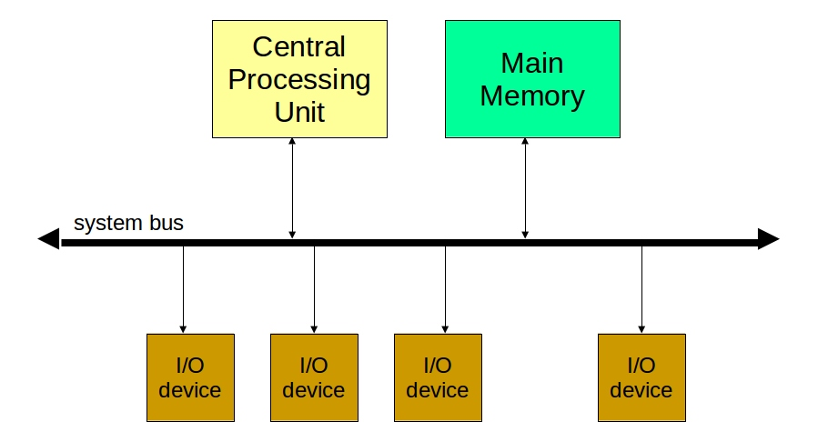
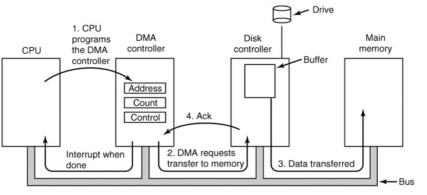
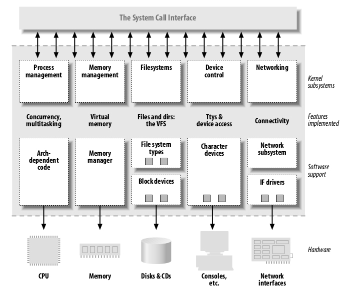
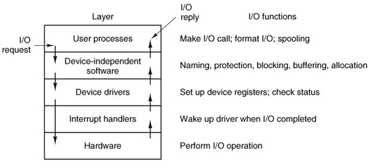
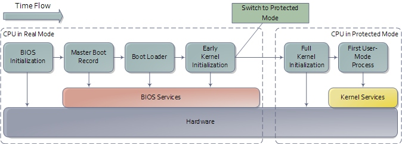

## Огляд роботи ОС з апаратною частиною

ОС реалізується поверх апаратної архітектури, яка визначає спосіб взаємодії і набір обмежень. Взаємодія відбувається безпосередньо — через видачу інструкцій процесору,— і опосередковано — через обробку переривань пристроїв. З моменту початку завантаження ОС покажчик на поточну інструкцію процесора (регістр IP) встановлюється в початкову інструкцію виконуваного коду ОС, після чого управління роботою процесора переходить до ОС.

Взаємодія процесора з зовнішніми пристроями (також зване введенням-виведенням) можливо тільки через адресуєму пам'ять. Існують 2 схеми передачі даних між пам'яттю і пристроями: PIO (Programmed IO - введення-виведення через процесор) і DMA (Direct Memory Access - прямий доступ до пам'яті). В основному використовується другий варіант, який покладається на окремий контролер, що дозволяє розвантажити процесор від управління введенням-виводом і таким чином прискорити роботу системи в цілому.

### Драйвери пристроїв

Драйвер пристрою - це комп'ютерна програма, яка реалізує механізм управління пристроєм і дозволяє програмам більш високого рівня взаємодіяти з конкретним пристроєм, не знаючи його команд та інших параметрів функціонування. Драйвер здійснює свої функції за допомогою команд контролера пристрою і обробки переривань, що приходять від нього. Як правило, драйвер реалізується як частина (модуль) ядра ОС, так як:

- обробка переривань драйвером вимагає задіювання функцій ОС
- справедлива і ефективна утилізація пристрої вимагає координації ОС
- посилка невірних команд або їх послідовностей, а також недотримання інших умов роботи з пристроєм може вивести його з ладу

Драйвери пристроїв деляться на 3 основні класи:

- Символьні - працюють з пристроями, що дозволяють передавати дані по 1 символу (байту): як правило, різні консолі, модеми і т.п.
- Блокові - працюють з пристроями, що дозволяють здійснювати буферизоване введення-виведення: наприклад, різними дисковими накопичувачами
- Мережеві

Драйвери окремих пристроїв об'єднуються ОС в класи, які надають однаковий абстрактний інтерфейс програмам більш високого рівня. Загалом цей інтерфейс називається Рівнем абстракції обладнання (Hardware absctraction layer, HAL).

### Час в комп'ютері

Для роботи ОС використовує апаратний таймер, який працює на заданій тактовій частоті (на даний момент, як правило 100 Гц). У Linux 1 цикл такого таймера називається `jiffies`. При цьому сучасні процесори працюють на тактовій частоті порядку ГГц, взаємодія з пам'яттю відбувається з частотою порядку десятків МГц, з диском і мережею - порядку сотень КГц. Загалом, це створює певну ієрархію операцій в компьютері за порядком часу, який необхідний для їх виконання.

## Переривання

### Апаратні переривання

Всі операції вводу-виводу вимагають тривалого часу на своє виконання, тому виконуються в асинхронному режимі. Тобто після виконання інструкції, що викликає введення-виведення, процесор не чекає його завершення, а перемикається на виконання інших інструкцій. Коли введення-виведення завершується, пристрій сигналізує про це за допомогою переривання. Таке переривання називається апаратним (жорстким) або ж асинхронним.

Загалом, **переривання** — це сигнал, що повідомляє процесору про настання якої-небудь події. При цьому виконання поточної послідовності команд припиняється і керування передається обробнику переривання, який реагує на подію і обслуговує її, після чого повертає керування в перерваний код.

PIC (Programmable Interrupt Controller —  програмований контролер переривань) - це спеціальний пристрій, який забезпечує сигналізацію про перериваннях процесору.

### Програмні переривання

Крім асинхронних переривань процесори підтримують також синхронні переривання двох типів:

- Виключення (Exceptions): помилки (fault) — припускають можливість відновлення, пастки (trap) — сигнали, які надсилаються після виконання команди і використовуються для зупинки роботи процесора (наприклад, при відлагодженні), і збої (abort) — не припускають відновлення
- Програмовані переривання

В архітектурі х86 передбачено 256 синхронних переривань, з яких перші 32 - це зарезервовані виключення, інші можуть бути довільно призначені ОС. Приклади стандартних виключень в архітектурі x86 з їх номерами:

	0: divide-overflow fault
	6: Undefined Opcode
	7: Coprocessor Not Available
	11: Segment-Not-Present fault
	12: Stack fault
	13: General Protection Exception
	14: Page-Fault Exception

:br

### Схема обробки переривань

Кожне переривання має унікальний номер, який використовується як зсув в таблиці обробників переривань. Ця таблиця зберігається в пам'яті комп'ютера і на її початок вказує спеціальний регістр процесора — IDT (Interrupt Descriptor Table).

При надходженні сигналу про переривання його потрібно обробити якомога швидше, для того щоб дати можливість проводити введення-виведення інших пристроїв. Тому процесор відразу перемикається в режим обробки переривання. За номером переривання процесор знаходить процедуру-обробник в таблиці IDT і передає їй управління. Обробник переривання, як правило, розбитий на 2 частини: верхню (top half) і нижню (bottom half).

Верхня частина виконує тільки той мінімальний набір операцій, який необхідний, щоб передати управління далі. Цей набір включає:

- Підтвердження переривання (яке дозволяє прихід нових переривань)
- Точне визначення пристрою, від якого прийшло переривання
- Ініціалізація процедури обробки нижньої частини і постановка її в чергу на виконання

Процедура нижній частині обробника виконує копіювання даних з буфера пристрою в пам'ять.

### Контексти

Обробники переривань працюють в т.зв. **атомарному контексті**. Перемикання контексту — це процес збереження стану регістрів процесора в пам'ять і установки нових значень для регістрів. Можна виділити як мінімум 3 контексти:

- Атомарний, який в свою чергу часто розбитий на контекст обробки апаратних переривань і програмних. У атомарному контексті у процесора немає інформації про те, яка програма виконувалася до цього, тобто немає зв'язку з користувацьким середовищем. У атомарному контексті не можна викликати блокують операції, в тому числі `sleep`.
- Ядерний - контекст роботи функцій самого ядра ОС.
- Користувацький - контекст роботи функцій користувацької програми, з якого не можна отримати доступ до пам'яті ядра.

## Домени безпеки

Для підтримки розмежування доступу до критичних ресурсів більшість архітектур реалізують концепцію **доменів безпеки** або ж **кілець процесора** (CPU Rings). Вся пам'ять ком'ютера промаркована номером кільця безпеки, до якого вона належить. Інструкції, що знаходяться в пам'яті, що відноситься до того чи іншого кільця, в якості операндів можуть використовувати тільки адреси, які відносяться до кілець за номером не більше даного. Тобто програми в кільці 0 мають максимальні привілеї, а в найбільшому за номером кільці — мінімальні.

На x86 архітектурі кілець 4: від 0 до 3. ОС з монолітним або модульним ядром (такі як Linux) завантажуються в кільце 0, а користувацькі програми — в кільце 3. Решта кілець у них не задіяні. У випадку мікроядерних архітектур деякі підсистеми ОС можуть завантажуватися в кільця 1 та/або 2.

У відповідності з концепцією доменів безпеки всі операції роботи з пристроями можуть виконуватися тільки з кільця 0, тобто вони реалізовані в коді ОС і надаються користувацьким програмам через інтерфейс системних викликів.

Введення-виведення є тривалою операцією за шкалою процесорного часу. Тому воно блокує викликавший його процес для того, щоб не викликати простою процесора.

## Завантаження

Завантаження (bootstrapping) — букв. витягування себе за власні шнурки — процес багатоступеневої ініціалізації ОС в пам'яті комп'ютера, який проходить через такі етапи:

1. Ініціалізація прошивки (firmware).
2. Вибір ОС-кандидата на завантаження.
3. Завантаження ядра ОС. На комп'ютерах з архітектурою x86 цей етап складається з двох підетапів:
	1. Завантаження в реальному режимі процесора.
	2. Завантаження в захищеному режимі.
4. Завантаження компонентів системи в користувацькому оточенні.

### Прошивка

Прошивка (Firmware) - це програма, записана в ROM-пам'ять комп'ютера. На комп'ютерах загального призначення прошивка виконує функцію ініціалізації апаратної частини і передачі управління ОС. Поширеними інтерфейсами прошивок є варіанти BIOS, OpenBootProm і EFI.

BIOS - це стандартний для x86 інтерфейс прошивки. Він має безліч історичних обмежень.

Алгоритм завантаження з BIOS:

1. Power-On Self-Test (POST) — тест працездатності процесора і пам'яті після включення живлення.
2. Перевірка дисків і вибір завантажувального диска.
3. Завантаження Головного завантажувального запису (Master Boot Record, MBR) завантажувального диска в пам'ять і передача управління цій програмі. MBR може містити від 1 до 4 записів про розділи диска.
4. Вибір завантажувального розділу. Завантаження завантажувальної програми (т.зв. 1-й стадії завантажувача) з завантажувального запису вибраного розділу.
5. Вибір ОС для завантаження. Завантаження завантажувальної програми самої ОС (т.зв. 2-й стадії завантажувача).
6. Завантаження ядра ОС в реальному режимі роботи процесора. Більшість сучасних ОС не можуть повністю завантажитися в реальному режимі (через жорсткі обмеження по пам'яті: для ОС доступно менше 1МБ пам'яті). Тому завантажувач реального режиму завантажує в пам'ять частина коду ОС і перемикає процесор в захищений режим.
7. Остаточне завантаження ядра ОС в захищеному режимі.

### Процес init

Після завершення завантаження ядра ОС, запускається перша програма в користувацькому оточенні. В заснованих на Unix системах це процес номер 0, який називається `idle`. Концептуально цей процес працює так:

	while (1) {
	    ; // do nothing
	}

Такий процес потрібен, тому що процесором повинні постійно виконуватися якісь інструкції, він не може просто чекати.

Процесом номер 1 в Unix-системах є процес `init`, який запускає всі сервіси ОС, які працюють у користувацькому оточенні. Це такі сервіси, як графічна оболонка, різні мережеві сервіси, сервіс періодичного виконання завдань (`cron`) і ін. Конфігурація цих сервісів і послідовності їх завантаження виконується за допомогою shell-скриптів, що знаходяться в директоріях `/etc/init.d/`, `/etc/rc.d/` та ін.

## Література

- [PC Architecture](http://www.karbosguide.com/books/pcarchitecture/start.htm)
- [What's New in CPUs Since the 80s and How Does It Affect Programmers?](http://danluu.com/new-cpu-features/)
- [Interrupts and Exceptions](http://www.cs.columbia.edu/~nahum/w6998/lectures/interrupts.ppt)
- [Interrupt Handling Contexts](http://0x657573.wordpress.com/2010/11/29/the-crisp-boundary-between-hardirq-context-softirq-context-and-user-context/)
- [Linux Insides series](https://github.com/0xAX/linux-insides)
    - [Interrupts and Interrupt Handling](https://github.com/0xAX/linux-insides/tree/master/interrupts)
    - [Timers and time management](https://github.com/0xAX/linux-insides/tree/master/Timers)
    - [Kernel boot process](https://github.com/0xAX/linux-insides/tree/master/Booting)
    - [Kernel initialization process](https://github.com/0xAX/linux-insides/tree/master/Initialization)
- [Jiffies](http://www.makelinux.net/books/lkd2/ch10lev1sec3)
- [Software Illustrated series by Gustavo Duarte](http://duartes.org/gustavo/blog/category/internals):
	- [CPU Rings, Privilege, and Protection](http://duartes.org/gustavo/blog/post/cpu-rings-privilege-and-protection)
    - [How Computers Boot Up](http://duartes.org/gustavo/blog/post/how-computers-boot-up)
	- [The Kernel Boot Process](http://duartes.org/gustavo/blog/post/kernel-boot-process)
- [The Linux/x86 Boot Protocol](https://github.com/torvalds/linux/blob/master/Documentation/x86/boot.txt)- [Latency Numbers Every Programmer Should Know](https://gist.github.com/jboner/2841832)
- [Linux Device Drivers, Third Edition](http://lwn.net/Kernel/LDD3/)
- [The Linux Kernel Driver Model: The Benefits of Working Together](https://books.google.com.ua/books?id=gJrmszNHQV4C&lpg=PA267&ots=rMTWwzUase&dq=The%20Linux%20Kernel%20Driver%20Model%3A%20The%20Benefits%20of%20Working%20Together&pg=PA267#v=onepage&q&f=false)- [Writing Device Drivers in Linux](http://www.freesoftwaremagazine.com/articles/drivers_linux)
- [Another Level of Indirection](http://www.spinellis.gr/pubs/inbook/beautiful_code/html/Spi07g.html)
- [x86 DOS Boot Sector Written in C](http://crimsonglow.ca/~kjiwa/x86-dos-boot-sector-in-c.html)
