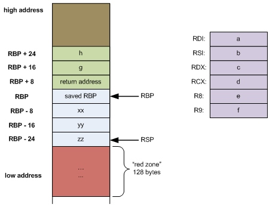
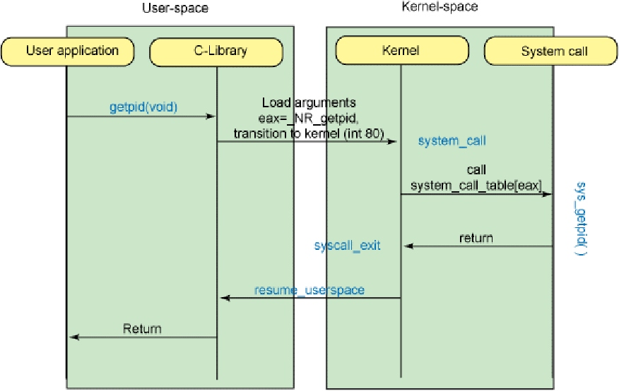

## Бинарный интерфейс приложений (ABI)

Бинарный интерфейс приложений — набор формальных спецификаций и неформальных соглашений в рамках программной платформы, обеспечивающих исполнение программ на платформе. Бинарному интерфейсу должны следовать все программы, однако вся работа по его реализации ложится на компилятор и, как правило, прозрачна для прикладных программистов.

Бинарный интерфейс включает:

- спецификацию типов данных: размеры, формат, последовательность байт (endiannes)
- форматы исполняемых файлов
- соглашения о вызовах
- формат и номера системных вызовов
- и др.

## Ассемблер

Ассемблер — это низкоуровневый язык, позволяющий непосредственно кодировать инструкции программной платформы (ОС или виртуальной машины).

Отличия ассемблера от языков более высокого уровня:

- отсутствие единого стандарта, т.е. у каждой архитектуры свой ассемблер
- программа на Ассемблере довольно прямо отражается в бинарный код объектного (исполняемого) файла; обратное преобразование — из объектного файла в ассемблерный код называется дизассемблированием
- в ассемблере нет понятия переменных, а также управляющих конструкций: выполнение программы происходит за счет манипуляции данными в регистрах и памяти напрямую, а также вызова других инструкций процессора
- отсутствие каких-либо проверок целостности данных (например, проверки типов)

:br

Синтаксис ассемблера составляют:

- литералы — константные значения, которые представляют сами себя (числа, адреса, строки, регистры)
- команды – мнемоники для записи соответствующих инструкций процессора
- метки — имена для адресов памяти
- директивы компилятора — интсрукции компилятору, описывающие различные аспекты создания из программы исполняемого файла (разрядность и секции программы, экспортируемые символы и т.д.) — не записываются напрямую в исполняемую программу
- макросы — конструкции для записи повторяющихся блоков кода, в результате выполнения которых на этапе компиляции выполняется подстановка этих кусков кода вместо имени макроса

Общепринятыми являются 2 синтаксиса ассемблера:

- AT&T
- Intel

Наиболее распространенные ассемблеры для архитектуры x86: NASM, GAS, MASM, TASM. Часть из них являются кросс-платформенными, т.е. работают в разных ОС, а часть — только в какой-либо одной ОС или группе ОС.

### Регистры процессора

Команды ассемблера позволяют напрямую манипулировать регистрами процессора. Регистр — это небольшой объем очень быстрой памяти (как правило, размером в 1 машинное слово), размещённой на процессоре. Он предназначен для хранения результатов промежуточных вычислений, а также некоторой информации для управления работой процессора. Так как регистры размещены непосредственно на процессоре, доступ к данным, хранящимся в них, намного быстрее доступа к данным в оперативной памяти.

Все регистры можно разделить на две группы: **пользовательские** и **системные**. Пользовательские регистры используются при написании "обычных" программ. В их число входят основные программные регистры, а также регистры математического сопроцессора, регистры MMX, XMM (SSE, SSE2, SSE3) и т.п. К системным регистрам относятся регистры управления, регистры управления памятью, регистры отладки, машинно-специфичные регистры MSR и другие.

### Адресация памяти

Ассемблером поддерживаются разные способы адресации памяти:

- непосредственная
- прямая (абсолютная)
- косвенная (базовая)
- автоинкрементная/автодекрементная
- регистровая
- относительная (в случае использования сегментной организации виртуальной памяти)

Порядок байтов (endianness) в машинном слове определяет последовательность записи байтов: от старшего к младшему (**big-endian**) или от младшего к старшему (**little-endian**).

### Стек

(Более правильное название используемой структуры данных — **стопка** или **магазин**. Однако, исторически прижилось заимствованное название стек).

Стек (stack) — это часть динамической памяти, которая используется при вызове функций для хранения ее аргументов и локальных переменных. В архитектуре x86 стек растет вниз, т.е. вершина стека имеет самый маленький адрес. Регистр `SP` (Stack Pointer) указывает на текущую вершину стека, а регистр `BP` (Base Pointer) указывает на т.н. базу, которая используется для разделение стека на логические части, относящиеся к одной функции — **фреймы** (кадры). Помимо обычных инструкций работы с памятью и регистрами (таких как `mov`), дополнительно для манипуляции стеком используются инструкции `push` и `pop`, которые заносят данные на вершину стека и забирают данные с вершины. Эти инструкции также осуществляют изменение регистра `SP`.

Как правило, в программах на высокоуровневых языках программирования нет кода для работы со стеком напрямую, а это делает за кадром компилятор, реализуя определенные соглашения о вызовах функций и способы хранения локальных переменных. Однако функция `alloca` библиотеки `stdlib` позволяет програмно выделять память на стеке.

Вызов функции высокоуровневого языка создает на стеке новый фрейм, который содержит аргументы функции, адрес возврата из функции, указатель на начало предыдущего фрейма, а также место под локальные переменные.

В начале работы программы в стеке выделен только 1 фрейм для функции `main` и ее аргументов — числового значения `argc` и массива указателей переменной длины `argv`, каждый из которых записывается на стек по отдельности, а также переменных окружения.

## Соглашения о вызовах

Соглашение о вызовах — это схема, в соответсвии с которой вызов функции высокоуровневого языка программирования реализуется в исполняемом коде. Соглашение о вызовах отвечает на вопросы:

- Как передаются аргументы и возвращаются значения? Они могут передаваться либо в регистрах, либо через стек, либо и так, и так (гибридная схема).
- Как распределяется работа (по манипуляции стеком вызовов) между вызывающей и вызванной стороной?

В принципе, соглашения не являются жестким стандартом, и программа не обязана следовать тому или иному соглашению для собственных функций (поэтому программы на ассемблере не всегда следуют ему), однако компиляторы создают исполняемые файлы в соответствии с тем или иным соглашением. Кроме того, соглашения о вызовах для библиотечных функций может отличаться от соглашения для системных вызовов: например, аргументы системных вызовов могут передаваться через регистры, а библиотечных функций — через стек.

Распространенные соглашения:

- `cdecl` — общепринятое соглашение для программ на языке С в архитектуре IA32: параметры кладутся на стек справо-налево, вызывающая функция отвечает за очистку стека после возврата из вызванной функции
- `stdcall` — стандартное соглашения для Win32: параметры кладутся на стек справо-налево, функция может использовать регистры `EAX`, `ECX` и `EDX`, вызванная функция отвечает за очистку стека перед возвратом
- `fastcall` — нестандартные соглашения, в которых передача одного или более параметров происходит через регистры для ускорения вызова
- `pascal` — параметры кладутся на стек слева-направо (противоположно `cdecl`) и вызванная функция отвечает за очистку стека перед возвратом
- `thiscall` — соглашение для С++
- `safecall` — соглашение для COM/OLE
- `syscall`
- `optlink`
- AMD64 ABI
- Microsoft x86 calling convention

Пример вызова в соответствии с соглашением `cdecl`:

Код на языке С:

    // вызываемая функция
    int callee(int a, int b, int c) {
       int d;
       d = a + b + c;
       ...
       return d;
    }

    // вызывающая функция
    int caller(void) {
        int rez = callee(1, 2, 3);
        return rez + 5;
    }

Сгенерированный компилятором ассемблерный код:

    // в вызывающей функции
    pushl   %ebp  // сохранение указателя на предыдущий фрейм
    movl    %esp,%ebp
    // запись аргументов в стек справа-налево
    pushl   $3
    pushl   $2
    pushl   $1
    call    callee
    addl    $12,%esp // очистка стека
    addl    $5,%eax // результат вызова — в регистре EAX
    leave
    ret

    // в вызванной функции calee(1, 2, 3)
    subl $4,%esp // выделение места под переменную d
    movl %eax,4(%ebp) // достаем аргумент a
    movl %ecx,8(%ebp) // достаем аргумент b
    addl %eax,%ecx // результат сложения остается в %eax
    movl %ecx,12(%ebp) // достаем аргумент c
    addl %eax,%ecx // результат сложения остается в %eax
    movl (%esp),%eax // присваиваем значение d
    // ...
    movl %eax,(%esp) // записываем d в %eax
    leave // эквивалент movl $ebp,$esp; pop $ebp
    ret

## Системные вызовы

В общем, **системный вызов** — это произвольная функция, которая реализуется ядром ОС и доступна для вызова из пользовательской программы. При выполнении системного вызова происходит переключение контекста из пользовательского в ядерный. Поэтому на уровне команд процессора системный вызов выполняется не как обычный вызов функции (инструкция `CALL`), а с помощью программного прерывания (в Linux это прерывание номер 80) или же с помощью инструкции `SYSENTER` (более современный вариант).

Пример выполнения системного вызова `write` с помощью программного прерывания:

	mov eax, 4        ; specify the sys_write function code
	                  ; (from OS vector table)
	mov ebx, 1        ; specify file descriptor stdout(1)
	mov ecx, str      ; move start address of string message
	                  ; to ecx register
	mov edx, str_len  ; move length of message (in bytes)
	int 80h           ; tell kernel to perform
	                  ; the system call we just set up

Пример выполнения системного вызова `write` с помощью инструкции `SYSENTER`:

    push str_len
    push str
    push 1
    push 4
    push ebp
    mov ebp, esp
    sysenter

Стандартная библиотека `libc` реализует свои функции поверх системных вызовов.

## Литература

- [Ассемблер в Linux для программистов C](http://ru.wikibooks.org/wiki/%D0%90%D1%81%D1%81%D0%B5%D0%BC%D0%B1%D0%BB%D0%B5%D1%80_%D0%B2_Linux_%D0%B4%D0%BB%D1%8F_%D0%BF%D1%80%D0%BE%D0%B3%D1%80%D0%B0%D0%BC%D0%BC%D0%B8%D1%81%D1%82%D0%BE%D0%B2_C)
- [Ассемблеры для Linux: Сравнение GAS и NASM](http://www.ibm.com/developerworks/ru/library/l-gas-nasm/)
- [Why Registers Are Fast and RAM Is Slow](http://www.mikeash.com/pyblog/friday-qa-2013-10-11-why-registers-are-fast-and-ram-is-slow.html)
- [x86 Registers](http://www.eecg.toronto.edu/~amza/www.mindsec.com/files/x86regs.html)
- [Kernel command using Linux system calls](http://www.ibm.com/developerworks/library/l-system-calls/)
- [The Linux Kernel: System Calls](http://www.win.tue.nl/~aeb/linux/lk/lk-4.html)
- [Sysenter Based System Call Mechanism in Linux 2.6](http://articles.manugarg.com/systemcallinlinux2_6.html)
- [Reverse Engineering for Beginners](http://yurichev.com/writings/RE_for_beginners-en.pdf)
