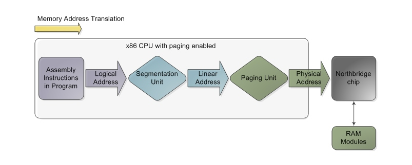
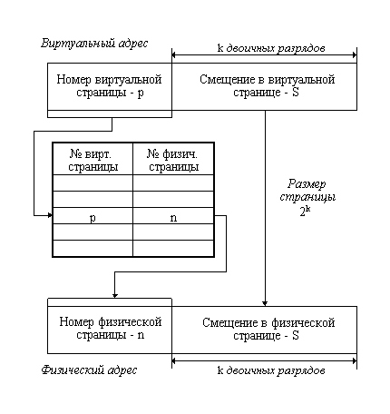
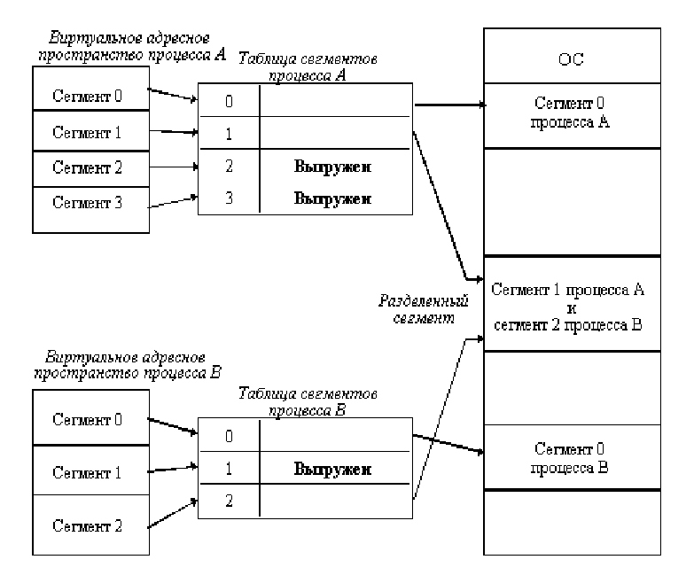
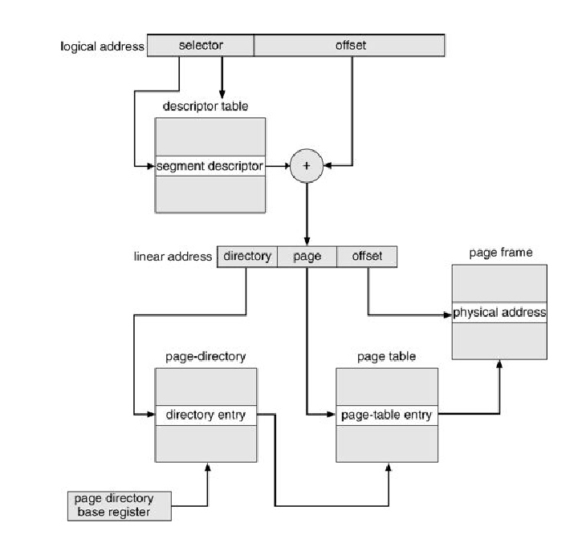
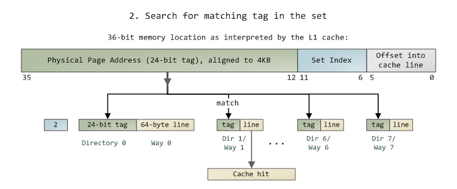

## Аппаратное управление памятью

Большинство компьютеров используют большое количество различных запоминающих устройств, таких как: ПЗУ, ОЗУ, жесткие диски, магнитные носители и т.д. Все они представляют собой виды памяти, которые доступны через разные интерфейсы. Два основных интерфейса — это прямая адресация процессором и файловые системы. Прямая адресация подразумевает, что адрес ячейки с данными может быть аргументом инструкций процессора.

Режимы работы процессора x86:

- реальный — прямой доступ к памяти по физическому адресу
- защищенный — использование виртуальной памяти и колец процессора для разграничения доступа к ней

## Виртуальная память

Виртуальная память — это подход к управлению памятью компьютером, который скрывает физическую память (в различных формах, таких как: оперативная память, ПЗУ или жесткие диски) за единым интерфейсом, позволяя создавать программы, которые работают с ними как с единым непрерывным массивом памяти с произвольным доступом.

Решаемые задачи:

- поддержка изоляции процессов и защиты памяти путём создания своего собственного виртуального адресного пространства для каждого процесса
- поддержка изоляции области ядра от кода пользовательского режима
- поддержка памяти только для чтения и с запретом на исполненение
- поддержка выгрузки не используемых участков памяти в область подкачки на диске (свопинг)
- поддержка отображённых в память файлов, в том числе загрузочных модулей
- поддержка разделяемой между процессами памяти, в том числе с копированием-при-записи для экономии физических страниц

Виды адресов памяти:

- физический - адрес аппаратной ячейки памяти
- логический - виртуальный адрес, которым оперирует приложение

За счет наличия механизма виртуальной памяти компиляторы прикладных програм могут генерировать исполняемый код в рамках упрощенной абстрактной линейной модели памяти, в которой вся доступная память представляется в виде непрерывного массива [машинных слов](http://ru.wikipedia.org/wiki/%D0%9C%D0%B0%D1%88%D0%B8%D0%BD%D0%BD%D0%BE%D0%B5_%D1%81%D0%BB%D0%BE%D0%B2%D0%BE), адресуемого с 0 до максимально возможного адреса для данной разрядности (`2^N`, где `N` - количество бит, т.е. для 32-разрядной архитектуры максимальный адрес — `2^32` = `#FFFFFFFF`).
Это значит что результирующие программы не привязаны к конкретным параметрам запоминающих устройств, таких как их объем, режим адресации и т.д.

Кроме того, этот дополнительный уровень позволяет через тот же самый интерфейс обращения к данным по адресу в памяти реализовать другие функции, такие как обращение к данным в файле (через механизм `mmap`) и т.д. Наконец, он позволяет обеспечить более гибкое, эффективное и безопасное управление памятью компьютера, чем при использовании физической памяти напрямую.

На аппаратном уровне виртуальная память, как правило, поддерживается специальным устройством — [Модулем управления памятью](http://en.wikipedia.org/wiki/Memory_management_unit).

## Страничная организация памяти

Страничная память — способ организации виртуальной памяти, при котором единицей отображения виртуальных адресов на физические является регион постоянного размера — страница.

При использовании страничной модели вся виртуальная память делится на N страниц таким образом, что часть виртуального адреса интерпретируется как номер страницы, а часть — как смещение внутри страницы. Вся физическая память также разделяется на блоки такого же размера — **фреймы**. Таким образом в один фрейм может быть загружена одна страница. **Свопинг** — это выгрузка страницы из памяти на диск (или другой носитель большего объема), который используется тогда, когда все фреймы заняты. При этом под свопинг попадают страницы памяти неактивных на данный момент процессов.

Таблица соответствия фреймов и страниц называется таблицей страниц. Она одна для всей системы. Запись в таблице страниц включает служебную информацию, такую как: индикаторы доступа только на чтение или на чтение/запись, находится ли страница в памяти, производилась ли в нее запись и т.д. Страница может находится в трех состояниях: загружена в память, выгружена в своп, еще не загружена в память (при изначальном выделении страницы она не всегда сразу размещается в памяти).

Размер страницы и количество страниц зависит от того, какая часть адреса выделяется на номер страницы, а какая на смещение. К примеру, если в 32-разрядной системе разбить адрес на две равные половины, то количество страниц будет составлять 2^16, т.е. 65536, и размер страницы в байтах будет таким же, т.е. 64 КБ. Если уменьшить количество страниц до 2^12, то в системе будет 4096 страницы по 1МБ, а если увеличить до 2^20, то 1 миллион страниц по 4КБ. Чем больше в системе страниц, тем больше занимает в памяти таблица страниц, соответственно работа процессора с ней замедляется. А поскольку каждое обращение к памяти требует обращения к таблице страниц для трансляции виртуального адреса, такое замедление очень нежелательно. С другой стороны, чем меньше страниц и, соотвественно, чем они больше по объему — тем больше потери памяти, вызванные внутренней фрагментацией страниц, поскольку страница является единицей выделения памяти. В этом заключается диллема оптимизации страничной памяти. Она особенно актуальна при переходе к 64-разрядным архитектурам.

Для оптимизации страничной памяти используются следующие подходы:

- специальный кеш — TLB (translation lookaside buffer) — в котором хранится очень небольшое число (порядка 64) наиболее часто используемых адресов страниц (основные страницы, к которым постоянно обращается ОС)
- многоуровневая (2, 3 уровня) таблица страниц — в этом случае виртуальный адрес разбивается не на 2, а на 3 (4,...) части. Последняя часть остается смещением внутри страницы, а каждая из остальных задает номер страницы в таблице страниц 1-го, 2-го и т.д. уровней. В этой схеме для трансляции адресов нужно выполнить не 1 обращение к таблице страниц, а 2 и более. С другой стороны, это позволяет свопить таблицы страниц 2-го и т.д. уровней, и подгружать в память только те таблицы, которые нужны текущему процессу в текущий момент времени или же даже кешировать их. А каждая из таблиц отдельного уровня имеет существенно меньший размер, чем имела бы одна таблица, если бы уровень был один

- инвертированная таблица страниц — в ней столько записей, сколько в системе фреймов, а не страниц, и индексом является номер фрейма: а число фреймов в 64- и более разрядных архитектурах существенно меньше теоретически возможного числа страниц. Проблема такого подхода — долгий поиск виртуального адреса. Она решается с помощью таких механизмов как: хеш-таблицы или кластерные таблицы страниц

:br

## Сегментная организация памяти

Сегментная организация виртуальной памяти реализует следующий механизм: вся память делиться на сегменты фиксированной или произвольной длины, каждый из которых характеризуется своим начальным адресом — **базой** или **селектором**. Виртуальный адрес в такой системе состоит из 2-х компонент: **базы** сегмента, к которому мы хотим обратиться, и **смещения** внутри сегмента.

### Историческая модель сегментации в архитектуре х86

В архитектуре х86 сегментная модель памяти была впервые реализована на 16-разрядных процессорах 8086. Используя только 16 разрядов для адреса давало возможность адресовать только 2^16 байт, т.е. 64КБ памяти. В то же время стандартный размер физической памяти для этих процессоров был 1МБ. Для того, чтобы иметь возможность работать со всем доступным объемом памяти и была использована сегментная модель. В ней у процессора было выделено 4 специализированных регистра `CS` (сегмент кода), `SS` (сегмент стека), `DS` (сегмент данных), `ES` (расширенный сегмент) для хранения базы текущего сегмента (для кода, стека и данных программы).

Физический адрес в такой системе расчитывался по формуле:

    addr = base << 4 + offset

Это приводило к возможности адресовать большие адреса, чем 1МБ — т.н. [Gate A20](http://en.wikipedia.org/wiki/Gate_A20#The_80286_and_the_high_memory_area).

См. также: <http://en.wikipedia.org/wiki/X86_memory_segmentation>

### Плоская модель сегментации

32-разрядный процессор 80386 мог адресовать 2^32 байт памяти, т.е. 4ГБ, что более чем перекрывало доступные на тот момент размеры физической памяти, поэтому изначальная причина для использования сегментной организации памяти отпала.

Однако, помимо особого способа адресации сегментная модель также предоставляет механизм защиты памяти через **кольца безопасности процессора**: для каждого сегмента в таблице сегментов задается значение допустимого уровня привилегий (DPL), а при обращении к сегменту передается уровень привилегий текущей программы (запрошенный уровень привилегий, RPL) и, если `RPL > DPL` доступ к памяти запрещен. Таким образом обеспечивается защита сегментов памяти ядра ОС, которые имеют `DPL = 0`. Также в таблице сегментов задаються другие атрибуты сегментов, такие как возможность записи в память, возможность исполнения кода из нее и т.д.

Таблица сегментов каждого процесса находится в памяти, а ее начальный адрес загружается в регистр `LDTR` процессора. В регистре `GDTR` процессора хранится указатель на глобальную таблицу сегментов.

В современных процессорах x86 используется "Плоская модель сегментации", в которой база всех сегментов выставлена в нулевой адрес.

:br

## Виртуальная память в архитектуре x86

Системные вызовы для взаимодействия с подсистемой виртуальной памяти:

- `brk`, `sbrk` - для увеличения сегмента памяти, выделенного для данных программы
- `mmap`, `mremap`, `munmap` - для отображения файла или устройства в память
- `mprotect` - изменение прав доступа к областям памяти процесса

Пример выделение памяти процессу:

## Алгоритмы выделения памяти

Эффективное выделение памяти предполагает быстрое (за 1 или несколько операций) нахождение свободного участка памяти нужного размера.

Способы учета свободных участков:

- битовая карта (bitmap) — каждому блоку памяти (например, странице) ставится в соответствие 1 бит, который имеет значение занят/свободен
- связный список — каждому непрерывному набору блоков памяти одного типа (занят/свободен) ставится в соответствеи 1 запись в связном списке блоков, в которой указывается начало и размер участка
- использование нескольких связных списков для участков разных размеров — см. алгоритм [Buddy allocation](http://en.wikipedia.org/wiki/Buddy_memory_allocation)

## Кеширование

Кеш — это компонент компьютерной системы, который прозрачно хранит данные так, чтобы последующие запросы к ним могли быть удовлетворены быстрее. Наличие кеша подразумевает также наличие запоминающего устройства (гораздо) большего размера, в которых данные хранятся изначально. Запросы на получение данных из этого устройства **прозрачно** проходят через кеш в том смысле, что если этих данных нет в кеше, то они запрашиваются из основного устройства и параллельно записываются в кеш. Соответственно, при последующем обращении данные могут быть извлечены уже из кеша. За счет намного меньшего размера кеш может быть сделан намного быстрее и в этом основная цель его существования.

По принципу записи данных в кеш выделяют:

- сквозной (write-through) — данные записываются синхронно и в кеш, и непосредственно в запоминающее устрйоство
- с обратной записью (write-back, write-behind) — данные записываются в кещ и иногда синхронизируются с запоминающим устройством

По принципу хранения данных выделяют:

- полностью ассоциативные
- множественно-ассоциативные
- прямого соответствия

### Алгоритмы замещения записей в кеше

Поскольку любой кеш всегда меньше запоминающего устройства, всегда возникает необходимость для записи новых данных в кеш удалять из него ранее записанные. Эффективное удаление данных из кеша подразумевает удаление наименее востребованных данных. В общем случае нельзя сказать, какие данные являются наименее востребованными, поэтому для этого используются эвристики. Например, можно удалять данные, к которым происходило наименьшее число обращений с момента их загрузки в кеш (least frequently used, **LFU**) или же данные, к которым обращались наименее недавно (least recently used, **LRU**), или же комбинация этих двух подходов (**LRFU**).

Кроме того, аппаратные ограничения по реализации кеша часто требуют минимальных расходов на учет служебной информации о ячейках, которой является также и использование данных в них. Наиболее простым способом учета обращений является установка 1 бита: было обращение или не было. В таком случае для удаления из кеша может использоваться алгоритм **часы** (или **второго шанса**), который по кругу проходит по всем ячейками, и выгружает ячейку, если у нее бит равен 0, а если 1 — сбрасывает его в 0.

Более сложным вариантом является использование аппаратного счетчика для каждой ячейки. Если этот счетчик фиксирует число обращений к ячейке, то это простой вариант алгоритма LFU. Он обладает следующими недостатками:

- может произойти переполнение счетчика (а он, как правило, имеет очень небольшую разрядность) — в результате будет утрачена вся информация об обращениях к ячейке
- данные, к которым производилось множество обращений в прошлом, будут иметь высокое значение счетчика даже если за последнее время к ним не было обращений

Для решения этих проблем используется механизм **старения**, который предполагает периодический сдвиг вправо одновременно счетчиков для всех ячеек. В этом случае их значения будут уменьшаться (в 2 раза), сохраняя пропорцию между собой. Это можно считать вариантом алгоритм LRFU.

## Литература

- [Управление памятью](http://citforum.ru/operating_systems/sos/glava_7.shtml)
- [Виртуальная память](http://gendocs.ru/v31765/?cc=9)
- [What Every Programmer Should Know About Memory](http://people.redhat.com/drepper/cpumemory.pdf)
- [The Memory Management Reference](http://www.memorymanagement.org/)
- [Software Illustrated series by Gustavo Duarte](http://duartes.org/gustavo/blog/category/internals):
	- [How The Kernel Manages Your Memory](http://duartes.org/gustavo/blog/post/how-the-kernel-manages-your-memory)
	- [Memory Translation and Segmentation](http://duartes.org/gustavo/blog/post/memory-translation-and-segmentation)
	- [Getting Physical With Memory](http://duartes.org/gustavo/blog/post/getting-physical-with-memory)
	- [What Your Computer Does While You Wait](http://duartes.org/gustavo/blog/post/what-your-computer-does-while-you-wait)
	- [Cache: a place for concealment and safekeeping](http://duartes.org/gustavo/blog/post/intel-cpu-caches)
    - [Page Cache, the Affair Between Memory and Files](http://duartes.org/gustavo/blog/post/page-cache-the-affair-between-memory-and-files)
- [How Bad Can 1GB Pages Be?](http://www.pvk.ca/Blog/2014/02/18/how-bad-can-1gb-pages-be/)
- [How Misaligning Data Can Increase Performance 12x by Reducing Cache Misses](http://danluu.com/3c-conflict/)
- [Real Mode Memory Management](http://www.internals.com/articles/protmode/realmode.htm)
- [Memory Testing from Userspace Programs](http://antirez.com/news/43)
