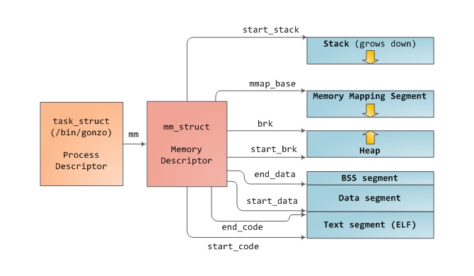
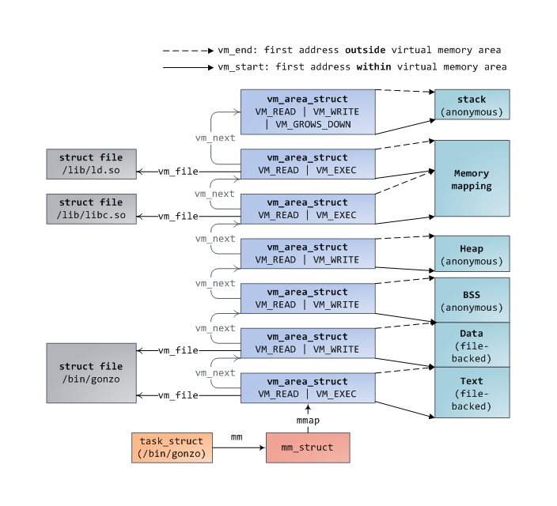
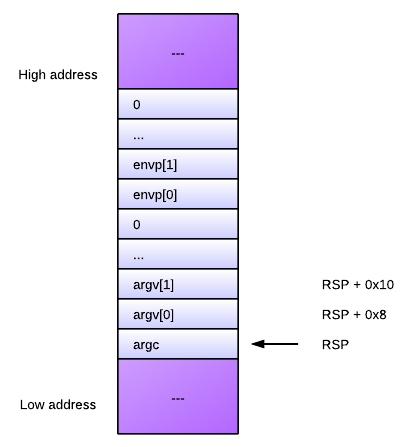
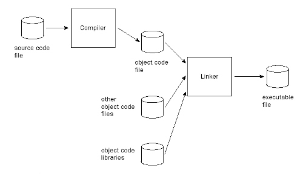
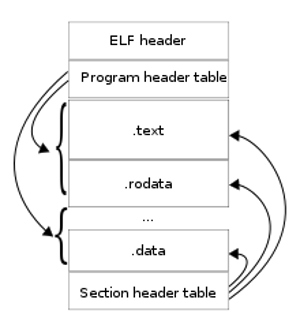
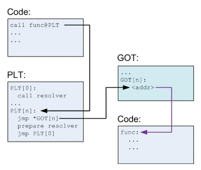

## Программа в памяти (в Linux)

Выполнение программы начинается с системного вызова `exec`, которому передается путь к файлу с бинарным кодом программы. `exec` — это интерфейс к загрузчику программ ОС, который загружает секции программы в память в зависимости от формата исполняемого файла, а также выделяет дополнительные секции динамической памяти. После загрузки память программы продолжает быть разделенной на отдельные секции. Указатели на начало/конец и другие свойства каждой секции находятся в структуре `mm_struct` текущего процесса.

Для загрузки отдельных сегментов в память используется системный вызов `mmap`.

### Статическая память программы

Статическая память программы — это часть памяти, которая является отображением кода объектного файла программы. Она инициализируется загрузчиком программ ОС из исполняемого файла (способ инициализации зависит от конкретного формата исполняемого файла).

Она включает несколько секций, среди которых общераспространенными являются:

- секция `text` — секция памяти, в которую записываются сами инструкции программы
- секция `data` — секция памяти, в которую записываются значения статических переменных программы
- секция `bss` — секция памяти, в которой выделяется место для записи значений объявленных, но не инициализированных в программе статических переменных
- секция `rodata` — секция памяти, в которую записываются значения констант программы
- секция таблицы символов — секция, в которой записаны все внешние (экспортируемые) символы программы с адресами их местонахождения в секциях `text` или `data` программы

### Динамическая память программы

Динамическая память выделяется программе в момент ее создания, но ее содержимое создается программой по мере ее выполнения. В области динамической памяти используется 3 стандартные секции, помимо которых могут быть и другие.

- стек (stack)
- куча (heap)
- сегмент отображаемой памяти (memory map segment)

Для выделения дополнительного объема динамической памяти используется системный вызов `brk`.

### Стек

(Более правильное название используемой структуры данных — **стопка** или **магазин**. Однако, исторически прижилось заимствованное название стек).

Стек (stack) — это часть динамической памяти, которая используется при вызове функций для хранения ее аргументов и локальных переменных. В архитектуре x86 стек растет вниз, т.е. вершина стека имеет самый маленький адрес. Регистр `SP` (Stack Pointer) указывает на текущую вершину стека, а регистр `BP` (Base Pointer) указывает на т.н. базу, которая используется для разделение стека на логические части, относящиеся к одной функции — **фреймы** (кадры). Помимо обычных инструкций работы с памятью и регистрами (таких как `mov`), дополнительно для манипуляции стеком используются инструкции `push` и `pop`, которые заносят данные на вершину стека и забирают данные с вершины. Эти инструкции также осуществляют изменение регистра `SP`.

Как правило, в программах на высокоуровневых языках программирования нет кода для работы со стеком напрямую, а это делает за кадром компилятор, реализуя определенные соглашения о вызовах функций и способы хранения локальных переменных. Однако функция `alloca` библиотеки `stdlib` позволяет программе выделять память на стеке .

Вызов функции высокоуровневого языка создает на стеке новый фрейм, который содержит аргументы функции, адрес возврата из функции, указатель на начало предыдущего фрейма, а также место под локальные переменные.

В начале работы программы в стеке выделен только 1 фрейм для функции `main` и ее аргументов — числового значения `argc` и массива указателей переменной длины `argv`, каждый из которых записывается на стек по отдельности, а также переменных окружения.

### Куча

Куча (heap) — это часть динамической памяти, предназначеная для выделения участков памяти произвольного размера. Она в первую очередь используется для работы с массивами неизвестной заранее длины (буферами), структурами и объектами.

Для управления кучей используется подсистема выделения памяти (memory allocator), интерфейс к которому — это функции `malloc`/`calloc` и `free` в `stdlib`.

Основные требования к аллокатору памяти:

- минимальное используемое пространство и фрагментация
- минимальное время работы
- максимальная **локальность** памяти
- максимальная настраиваемость
- максимальная совместимость со стандартнами
- максимальная переносимость
- обнаружение наибольшего числа ошибок
- минимальные аномалии

Многие языки высокого уровня реализуют более высокоуровневый механизм управления памятью поверх системного аллокатора — автоматическое выделение памяти со сборщиком мусора. В этом случае в программы не производится вызов функции `malloc`, а управление памятью осуществляет среда исполнения программы.

Варианты реализации сборки мусора:

- подсчет ссылок
- трассировка/с выставлением флагов (Mark and Sweep)

### Сегмент файлов, отображаемых в память

Сегмент файлов, отображаемых в память — это отдельная область динамической памяти, которая используется для эффективно работы с файлами, а также для подключения участков памяти других программ с помощью вызова `mmap`.

## Исполняемые файлы

В результате компиляции программы в машинный код создается исполняемый файл, т.е. файл, содержащий непосредственно инструкции процессора.

Типы исполняемых файлов:

- объектный файл (object file) — файл, преобразованный компилятором, но не приведенный окончательно к виду исполняемого файла в одном из форматов исполняемых файлов
- исполняемая программа (executable) — файл в одном из форматов исполняемых файлов, который может быть запущен загрузчиком программ ОС
- разделяемая библиотека (shared library) — программа, которая не может быть запущенна самостоятельно, а подключается (компилятором) как часть других программ
- снимок содержимого памяти (core dump) — снимок состояния памяти программы в момент ее исполнения — позволяет продолжить исполнение программы с того места, на котором он был создан

### Форматы исполняемых файлов

Формат исполняемых файлов — это определенная структура бинарного файла, которую формируют комилятор и компоновщик программы, и которая используется загрузчиком программ ОС.

В рамках формата исполняемых файлов описывается:

- способ задания секций файла, их количество и порядок
- метаданные, их типы и размещение в файле
- каким образом файл будет загружаться: по какому адресу в памяти, в какой последовательности
- способ описания импортируемых и экспортируемых символов
- ограничения на размер файла и т.п.

Распространенные форматы:

- .COM
- a.out
- COFF
- DOS MZ Executable
- Windows PE
- Windows NE
- ELF

Формат ELF (Executable and Linkable Format) — стандартный формат исполняемых файлов в Linux. Файл в этом формате содержит:

- заголовок файла
- таблицу заголовков сегментов программы
- таблицу заголовков секций программы
- блоки данных

Сегменты программы содержат информацию, используемую загрузчиком программы, а секции — используемую компоновщиком.

Также в исполняемом файле может записываться отладочная информация. Некоторые форматы имеют встроенную поддержку для этого, а для некоторых форматов используются дополнителнения, такие как:

- stabs
- DWARF

## Библиотеки

Библиотеки содержат функции, выполняющие типичные действия, которые могут использоваться другими программами. В отличие от исполняемой программы библиотека не имеет точки входа (функции `main`) и предназначена для подключения к другим программам или библиотекам. Стандартная библиотека C (`libc`) — первая и основная библиотека любой программы на C.

Библиотеки могут подключаться к программе в момент:

- сборки - build time (такие библиотеки называются статическими)
- загрузки - load time
- исполнения - run time

Разделяемые библиотеки — это библиотеки, которые подключаются в момент загрузки или исполнения программы и могут разделяться между несколькими программами в памяти для экономии памяти. Помимо этого они не включаются в код программы и таким образом не увеличивают его объем. С другой стороны, они в большей степени подвержены проблеме конфликта версий зависимостей разных компонент (в применении к библиотека также называемой DLL hell).

Способы подключения разделяемых библиотек в Unix:

- релокации времени загрузки программы
- позиционно-независимый код (PIC)

Релокации времени загрузки программы используют специальную секцию исполняемого файла — таблицу релокации, в которой записываются преобразования, которые нужно произвести с кодом библиотеки при ее загрузке. Ее недостатки — увеличение времени загрузки программы из-за необходимости переписывания кода библиотеки для применения всех релокаций на этом этапе, а также невозможность сделать секцию кода библиотеки разделяемой в памяти из-за того, что релокация для каждой программы применяться по-разному, т.к. библиотека загружается в память по разным виртуальным адресам.

Позиционно-независимый код использует таблицу глобальных отступов (Global Offset Table, GOT), в которой записываются адреса всех экспортируемых символов библиотеки. Его недостаток — это замедление всех обращений к символам библиотеки из-за необходимости выполнять дополнительное обращение к GOT.

Для поддержки позднего связывания функций через механизм "трамплина" также используется таблица компоновки процедур (Procedure Linkage Table, PLT).

## Виртуальные машины

Виртуальная машина — это программная реализация реального компьютера, которая исполняет программы.

Применения виртуальных машин:

- увеличение переносимости кода
- исследование и оптимизация программ
- эмулятор
- песочница
- виртуализация
- платформа для R&D языков програмиирования
- платформа для R&D различных компьютерных систем
- сокрытие программ (вирусы)

Типы:

- системная — полная эмуляция компьютера
- процессная — частичная эмуляция компьютера для одного из процессов ОС

### Системные ВМ

Виды системных ВМ:

- Гипервизор/монитор виртуальных машин: тип 1 (на голом железе) и тип 2 (на ОС-хозяине)
- Паравиртуализация

Требования Попека и Голдберга для эффективной виртуализации:

- Все чувствительные инструкции аппаратной архитектуры являются привилегированными
- Нет временных ограничений на выполнение инструкций (рекурсивная виртуализация)

Примеры: VMWare, VirtualBox, Xen, KVM, Quemu, Linux LXC containers, Solaris zones

### Процессные ВМ

Процессные ВМ функционируют по принципу 1 процесс – 1 экземпляр ВМ и, как правило, предоставляют интерфейс более высокого уровня, чем аппаратная платформа.

Код программы для таких ВМ компилируется в промежуточное представление (**байт-код**), который затем интерпретируется ВМ. Часто в них также используется JIT-компиляция байт-кода в родной код.

Варианты реализации:

- Стек-машина (0-операнд)
- Аккумулятор-машина (1-операнд)
- Регистровая машина (2- или 3-операнд)

Примеры: JVM, .Net CLR, Parrot, LLVM, Smalltalk VM, V8

## Литература

- [Anatomy of a Program in Memory](http://duartes.org/gustavo/blog/post/anatomy-of-a-program-in-memory)
- [How is a binary executable organized](http://jvns.ca/blog/2014/09/06/how-to-read-an-executable/)
- [Inside Memory Management](http://www.ibm.com/developerworks/linux/library/l-memory/)
- [Stack frame layout on x86-64](http://eli.thegreenplace.net/2011/09/06/stack-frame-layout-on-x86-64/)
- Eli Bendrski on Static and Dynamic Object Code in Linux:
	- [How Statically Linked Programs Run on Linux](http://eli.thegreenplace.net/2012/08/13/how-statically-linked-programs-run-on-linux/)
	- [Load-time relocation of shared libraries](http://eli.thegreenplace.net/2011/08/25/load-time-relocation-of-shared-libraries/)
	- [Position Independent Code (PIC) in shared libraries](http://eli.thegreenplace.net/2011/11/03/position-independent-code-pic-in-shared-libraries/)
	- [Position Independent Code (PIC) in shared libraries on x64](http://eli.thegreenplace.net/2011/11/11/position-independent-code-pic-in-shared-libraries-on-x64/)
- [How To Write Shared Libraries](http://software.intel.com/sites/default/files/m/a/1/e/dsohowto.pdf)
- [Executable and Linkable Format (ELF)](http://www.bottomupcs.com/elf.html)
- [Why do Windows functions all begin with a pointless MOV EDI, EDI instruction?](http://blogs.msdn.com/b/oldnewthing/archive/2011/09/21/10214405.aspx)
