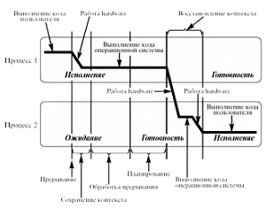
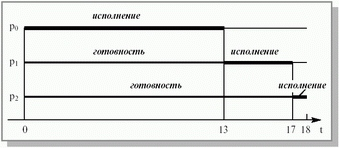
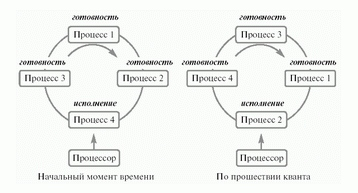

## Процес

Процес - це адресний простір і єдина нитка управління. (Застаріле визначення)

Більш точно поняття процесу включає в себе:

- Програму, яка виконується
- Її динамічний стан (регістровий контекст, стан пам'яті і т.д.)
- Доступні ресурси (як індивідуальні для процесу, такі як дескриптори файлів, так і що розділяються з іншими)

В ОС структура Процес (Process control block) - одна з ключових структур даних. Вона містить всю інформації про процес, необхідну різним підсистемам ОС. Ця інформація включає:

- PID (ID процесу)
- PPID (ID процесу-батька)
- Шлях і аргументи, з яким запущений процес
- Програмний лічильник
- Покажчик на стек
- і т.і.

Нижче наведена невелика частина цієї структури в ОС Linux:

	#include<sched.h>
	struct task_struct {
            /* Стан:
             * -1 - заблокований,
             *  0 - готовність,
             * >0 - зупинений */
	        volatile long state;
	        void *stack;
	        unsigned long flags;
	        int prio, static_prio, normal_prio;
	        struct list_head run_list;
	        const struct sched_class *sched_class;
	        ...
	/* task state */
	        struct linux_binfmt *binfmt;
	        long exit_state;
	        int exit_code, exit_signal;
	        int pdeath_signal;
	        pid_t pid;
	        pid_t tgid;
	        struct task_struct *real_parent;
	        struct task_struct *parent;     
	        struct list_head children;      
	        struct list_head sibling;
	        struct task_struct *group_leader; 
	        struct timespec start_time;
	        struct timespec real_start_time;
	        ...
	/* process credentials */
	        uid_t uid,euid,suid,fsuid;
	        gid_t gid,egid,sgid,fsgid;
	        struct group_info *group_info;
	        kernel_cap_t cap_effective,
                cap_inheritable, cap_permitted;
	        unsigned keep_capabilities:1;
	        struct user_struct *user;
	        ...
	/* open file information */
	        struct files_struct *files;
	/* namespace */
	        struct nsproxy *nsproxy;
	/* signal handlers */
	        struct signal_struct *signal;
	        struct sighand_struct *sighand;
	        ...
	};

### Нитка управління

Нитка управління (thread) — це один логічний ланцюжок виконання команд. В одному процесі може бути як одна нитка управління, так і декілька (в системах, що підтримують багатопоточність — multithreading).

ОС надає інтерфейс для створення ниток управління і в цьому випадку бере на себе їх планування на рівні з плануванням процесів. У стандарті POSIX описаний подібний інтерфейс, який реалізований в бібліотеці **PTHREADS**. Нитки, що надаються ОС, називаються **рідними** (native). Однак будь-який процес може організувати управління нитками усередині себе незалежно від ОС (фактично, в рамках однієї рідної нитки ОС). Такий підхід називають **зеленими** або **легковагими** нитками.

Волокно (fiber) - легковага нитка, яка працює в системі кооперативної багатозадачності (див. нижче).

Переваги рідних ниток:

- Не вимагають додаткових зусиль по реалізації
- Використовують стандартні механізми планування ОС
- Блокування і реакція на сигнали ОС відбувається в рамках нитки, а не всього процесу

Переваги зелених ниток:

- Потенційно менші накладні витрати на створення і підтримку
- Не вимагають перемикання контексту при системних викликах, що дає потенційно більшу швидкодію
- Гнучкість: процес може реалізувати будь-яку стратегію планування таких ниток

### Види процесів

Процеси можуть запускатися для різних цілей:
- виконання якихось єдиноразових дій (наприклад, скрипти)
- виконання завдань під управлінням користувача (інтерактивні процеси, такі як редактор)
- безперервної роботи у фоновому режимі (сервіси або демони, такі як сервіс термінала або поштовый сервер)

Процес-демон — це процес, який запускається для довгострокової роботи у фоновому режимі, відключається від терміналу, який його запустив (його стандартні потоки вводу-виводу закриваються або перенаправляються у лог-файл), і змінює свої права доступу на мінімально необхідні. Управління таким процесом, звичайно, здійснюється за допомогою механизму сигналів ОС. 

:br

## Життєвий цикл процесу

### Породження процесу

Всі процеси ОС, за винятком першого процесу, який запускається після завантаження ядра, мають батька. Створення нового процесу вимагає ініціалізації структури PCB і запуску (постановки на планування) нитки управління процесу. Основною вимогою до цих операцій є швидкість виконання. Ініціалізація структури PCB з нуля є витратною операцією, крім того породженому процесу, як правило, потрібен доступ до деяких ресурсів (таких як потоки вводу-виводу) батьківського процесу. Тому зазвичай структура нового процесу створюється методом **клонування** структури батька. Альтернативою є завантаження попередньо ініціалізованої структури з файлу і її модифікація.

Модель **fork/exec** - це модель двоступеневого породження процесу в Unix-системах. На першому ступені за допомогою системного виклику `fork` створюється ідентична копія поточного процесу (для забезпечення швидкодії, як правило, через механізм копіювання-при-запису - copy-on-write, COW). На другому етапі за допомогою операції `exec` в пам'ять створеного процесу завантажується нова програма. У цій моделі процес-батько має можливість дочекатися завершення дочірнього процесу за допомогою системних викликів сімейства `wait`. Розбивка цієї операції на два етапи дає можливість легко породжувати ідентичні копії процесу (наприклад, для масштабування програми — такий спосіб застосовується в мережевих серверах), а також гнучко управляти ресурсами, доступними дочірньому процесу.

### Завершення процесу

По завершенню процес повертає цілочисельний код повернення (exit code) — результат виконання функції `main`. У Unix-системах код повернення, рівний 0, сигналізує про успіх, всі інші говорять про помилку (розробник програми може довільно зіставляти помилки їх кодам повернення).

Використовуючи функції сімейства `wait`, один процес може очікувати завершення іншого. Це часто використовується в батьківських процесах, яким потрібно отримати інформацію про завершення своїх нащадків, щоб продовжити роботу. Виклики `wait` є блокуючими — функція не завершиться, поки не завершиться процес, якого вона чекає.

Якщо нащадок завершується, але батьківський процес не викликає `wait`, нащадок стає т.зв. процесом зомбі. Це завршені процеси, інформація про завершення яких ніким не запрошена. Втім, після завершення батьківського процесу всі його нащадки переходять до процесу з PID 1, тобто `init`. Він самостійно очищає інформацію, що залишилася після зомбі.

Приклад програми, що породжує новий процес і очікує його завершення:

	#include <sys/types.h>
	#include <unistd.h>
	#include <stdio.h>
	#include <stdlib.h>
	
	int main() {
	    /* Клонуємо поточний процес */
	    pid_t childpid = fork();
	
	    /* Змінна childpid буде існувати
         * і в оригінальному процесі, і в його клоні,
         * але у дочірньому процесі вона буде 0 */
	    if (!childpid) {
	        // Це дочірній процес
	        char* command[3] = {"echo", "Hello, world!", 0};
	        execvp(command[0], command);
	
	        /* Якщо не відбулося ніяких помилок,
             * execvp() не завершується, і програма
             * ніколи не досягнемо цієї ділянки коду */
	        exit(EXIT_FAILURE);
	    } else if (childpid == -1) {
            // fork() повертає -1 у випадку помилки
	        fprintf(stderr, "Can't fork, exiting...\n");
	        exit(EXIT_FAILURE);
	    } else {
	        // Це батьківський процес
	        exit(EXIT_SUCCESS);
	    }
	
	    return 0;
	}

### Робота процесу

У мультіпроцессних системах всі процеси виконуються на процесорі не весь час своєї роботи, а тільки його частину. Відповідно, можна виділити:

- загальний час знаходження процесу в системі: від запуску до завершення
- (чистий) час виконання процесу
- час очікування

У стан очікування процес може перейти або при надходженні переривання від процесора, або після виклику самим процесом блокуючої операції, або після добровільної передачі процесом управління ОС (виклик планувальника `schedule` при витісняючий багатозадачності або ж операція `yield` при кооперативної багатозадачності).

При переході процесу в стан очікування відбувається **перемикання контексту** і запуск на процесорі коду ядра ОС (коду обробки переривань або коду планувальника). Перемикання контексту вимагає збереження в пам'яті змісту пов'язаних з виконуваним процесом регістрів і завантаження в регістри значень для наступного процесу.

У системах із витісняючою багатозадачності переривання `CLOCK INTERRUPT` викликає планувальник ОС, який переводить процес в стан очікування, якщо відведений йому на виконання час минув.

Завершення блокуючих операцій знаменується перериванням, при обробці якого ОС переводить заблокований процес в стан готовності до роботи.

## Планування процесів

Багатозадачність — це властивість операційної системи або середовища програмування забезпечувати можливість паралельної (або псевдопараллельной) обробки декількох процесів.

Види багатозадачності:

- Витісняюча
- Невитісняюча
- Кооперативна (підвид невитісняючої)

Витісняюча багатозадачність потребує наявність в ОС спеціальної програми-планувальника процесів, який приймає рішення про те, який процес повинен виконуватися і скільки часу відвести йому на виконання. Після завершення відведеного часу процес примусово переривається і керування передається іншому процесу.

При невитісняючий багатозадачності процеси працюють по черзі, причому перемикання відбувається по завершенню всього процесу або логічного блоку в його рамках. Кооперативна багатозадачність - це варіант невитісняючої багатозадачності, в якій тільки сам процес може сигналізувати ОС про готовність передати управління.

### Алгоритми планування процесів

Планування процесів застосовується в системах з витісняючою багатозадачністю.

Вимоги до алгоритмів планування:

- Справедливість
- Ефективність (в сенсі утилізації ресурсів)
- Стабільність
- Масштабованість
- Мінімізація часу: виконання, очікування, відгуку

Алгоритми планування для вибору наступного процесу на виконання, як правило, використовують **пріоритет** процесу. Пріоритет може визначатися статично (один раз для процесу) або ж динамічно (перераховуватися на кожному кроці планування).

### Алгоритм Перший прийшов — перший обслугований (FCFS)

Це простий алгоритм з найменшими накладними витратами. Це алгоритм зі статичним пріоритетом, в якості якого виступає час приходу процесу. Це найменш стабільний алгоритм, який не може гарантувати прийнятний час відгуку в інтерактивних системах, тому він застосовується тільки в системах batch-обробки.

### Алгоритм Карусель (Round Robin)

Цей алгоритм визначає поперемінне виконання всіх процесів протягом однакового кванту часу, після завершення якого незалежно від стану процесу він переривається і керування переходить до наступного процесу. Цей алгоритм є найбільш стабільним і простим. Він взагалі не використовує пріоритет процесу.

### Алгоритм справедливого планування

В основі цього алгоритму лежить принцип: з усіх кандидатів на виконання повинен вибиратися той, у якого відношення чистого часу фактичної роботи до загального часу перебування в системі найменше. Іншими словами, цей алгоритм використовує динамічний пріоритет, який обчислюється за формулою `p = t / T` (де `t` - чистий час виконання, `T` - час, що минув від запуску процесу; чим менше значення `p`, тим пріоритет вище).

### Алгоритм Багаторівнева черга зі зворотнім зв'язком

Як приклад більш складного адаптивного алгоритму можуть служити багаторівневі черги із зворотним зв'язком, які приймають рішення про пріоритет процесу на основі часу, який необхідний йому для завершення роботи або поточного логічного блоку.

### Реальні алгоритми

Алгоритми, що застосовуються в реальних системах, діляться на алгоритми для інтерактивних систем і алгоритми для систем реального часу. Алгоритми для систем реального часу завжди мають обмеження на час завершення окремих операцій, тому їм для планування необхідна додаткова інформація, якої, як правило, немає в інтерактивних системах — наприклад, час до завершення процесу.

В основі реальних алгоритмів лежать базові алгоритми, перераховані вище, але також вони використовують деякі додаткові парамаетри такі як:

- Епохи (часові інтервали, в кінці яких накопичена для планування інформація обнуляється)
- Угрупування процесів по класах (м'якого реального часу, процеси ядра, інтерактивні, фонові і т.д.) для забезпечення кращого часу відгуку системи

Крім того, в таких системах враховуються технології Симетричний мультіпроцесінг (Symmetrical Multiprocessing, SMP) і Одночасна багатопоточність (Symulteneous Multithreading, SMT), при яких кілька ядер процесора або кілька логічних потоків виконання в процесорі працюють із загальною пам'яттю.

## Міжпроцесна взаємодія (IPC)

### Цілі взаємодії:

- модульність (шлях Unix: маленькі шматочки, слабко пов'язані між собою, які роблять щось одне і роблять це дуже добре)
- масштабування
- спільне використання даних
- поділ привілеїв
- зручність

### Типи взаємодії:

- Через поділювану пам'ять
- Обмін повідомленнями
	- Сигнальний
	- Канальний
- Широкомовний

### Взаємодія через поділювану пам'ять

Найшвидший і найпростігий спосіб взаємодії, при якому процеси записують і зчитують дані із загальної області пам'яті. Він не вимагає жодних накладних витрат, але потребує домовленості про формат записуваних даних. Проблеми цього підходу:

- необхідність блокуючої синхронізації для забезпечення неконфліктного доступу до спільної пам'яті
- збільшення логічної зв'язності між окремими процесами
- неможливість масштабуватися за рамками пам'яті одного комп'ютера

### Обмін повідомленнями

Передача повідомлень володіє прямо протилежними властивостями і вважається кращим способом організації взаємодії в загальному випадку. Повідомлення можуть передаватися як індивідуально, так і в рамках виділеної сесії обміну повідомленнями.

### Сигнальный спосіб взаємодії

Сигнальний спосіб — це варіант взаємодії через передачу повідомлень, який припускає можливість відправки тільки заздалегідь відомих сигналів, які не мають ніякого навантаження у вигляді даних. Таким чином сигнали можуть передавати інформацію тільки про заздалегідь заданий набір подій. Така система є простою, але не здатна обслуговувати всі варіанти взаємодії. Тому вона часто застосовується для обслуговування критичних сценаріїв роботи.

Системний виклик `kill` дозволяє посилати сигнали процесам Unix. Серед них є зарезервовані сигнали, такі як:

- `TERM` — запит на завершення процесу
- `HUP` — запит на перезапуск процесу
- `ABRT` — запит на скасування поточної операції
- `PIPE` — сигнал про закриття конвеєра іншим процесом
- `KILL` — сигнал про примусове завершення процесу
- та ін.

Процес в Unix зобов'язаний обробити сигнал, який надішов до нього, інакше ОС примусово завершує його роботу.

### Канальный спосіб взаємодії

Канальний спосіб — це варіант взаємодії через передачу повідомлень, при якому між процесами встановлюється канал з'єднання, в рамках якого передаються повідомлення. Цей канал може бути як одностороннім (повідомлення йдуть тільки від одного процесу до іншого), так і двостороннім.

Pipe (конвеєр, анонімний канал) — односторонній канал, який дозволяє процесам передавати дані у вигляді потоку байт. Це найпростіший спосіб взаємодії в Unix, що має спеціальний синтаксис в командних оболонках (`proc1 | proc2`, що означає, що дані з процесу `proc1` передаються в `proc2`). Анонімний канал створюється системним викликом `pipe`, який приймає на вхід масив з двох чисел і записує в них два дескриптора (один з них відкритий на запис, а інший — на читання).

Особливості анонімних каналів:

- дані передаються порядково
- не заданий формат повідомлень, тобто процеси самі повинні "домовлятися" про нього
- помилка в каналі призводить до посилки сигналу `PIPE` до процесу, який намагався виконати читання або запис в нього

Іменований канал (named pipe) створюється за допомогою системного виклику `mkfifo`. Фактично, він є правильним замінником для обміну даними через тимчасові файли, оскільки той володіє наступними недоліками:

- використання повільного диска замість більш швидкої пам'яті
- витрата місця на диску (в той час як при обміні даними через FIFO після зчитування вони стираються); більш того, місце на диску може закінчитися
- у процесу може не бути прав створити файл або ж файл може бути зіпсований/видалений іншим процесом

### Модель Акторів

Модель акторів Х'ювіта — це теоретична модель, що досліджує взаємодію незалежних програмних агентів.

Актор — це незалежний легковагий процес, який взаємодіє з іншими процесами тільки через передачу повідомлень. У цій моделі процес не використовує поділювану пам'ять.

Ця модель лежить в основі мови програмування Erlang, а також бібліотека для організації розподіленої роботи Java-додатків Akka.

## Література

- [POSIX: командная оболочка и системные вызовы](http://ro-che.info/docs/2010-10-22-posix.pdf)
- [Advanced Linux Programming: Processes](http://www.advancedlinuxprogramming.com/alp-folder/alp-ch03-processes.pdf)
- [Daemons, Signals, and Killing Processes](http://www.freebsd.org/doc/handbook/basics-daemons.html)
- [Taxonomy of UNIX IPC Methods](http://catb.org/~esr/writings/taoup/html/ch07s02.html)
- [Understanding the Linux Kernel - 10. Process Scheduling](http://oreilly.com/catalog/linuxkernel/chapter/ch10.html)
- [The Linux Process Scheduler](http://www.informit.com/articles/article.aspx?p=101760&seqNum=2)
- [Linux Kernel 2.4 Internals - 2. Process and Interrupt Management](http://tldp.org/LDP/lki/lki-2.html)
- [ULE: A Modern Scheduler For FreeBSD](http://www.scribd.com/doc/3299978/ULE-Thread-Scheduler-for-FreeBSD)
- [How Linux 3.6 nearly broke PostgreSQL](http://lwn.net/Articles/518329/)
- [How Erlang does scheduling](http://jlouisramblings.blogspot.dk/2013/01/how-erlang-does-scheduling.html)
- [Daemons, Signals, and Killing Processes](http://www.freebsd.org/doc/handbook/basics-daemons.html)
