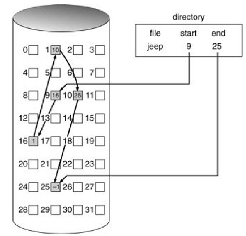
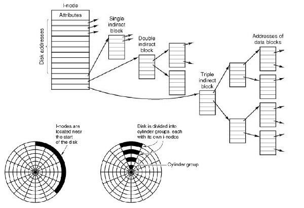

## Файловая система

Файловая система (ФС) — это компонент ОС, отвечающий за постоянное хранение данных.

Задачи:

- хранение данных в потенциально неограниченных объемах
- долгосрочное сохранение данных (persistence)‏
- одновременная доступность данных многим процессам

В отличие от оперативной памяти ФС являются постоянной памятью, поэтому на первое место для них выходят сохранность и доступность данных, а затем уже стоит быстродействие.

Некоторые из видов файловых систем:

- Дисковые
- Виртуальные (в памяти и не только)
- Сетевые
- Распределенные
- Мета ФС (ФС, которые используют другие ФС для организации хранения данных, а сами добавляют особую логику работы)

[Список ФС](http://en.wikipedia.org/wiki/List_of_file_systems)

Файловый интерфейс — это простой и удобный способ работы с данными, поэтому многие ОС распространяют его на другие объекты, помимо файлов данных. Например, в Unix все устройства подключаются в системе как специальные файлы (символьно-специфичные — для устройств с последовательным вводом-выводом; и блочно-специфичные — для устройств с буферизированным вводом-выводом). Кроме того, в Linux есть специальные виртуальные файловые системы: `sysfs`, которая оперируют файлами, отображающими системные структуры данных из памяти ядра, а также `tmpfs`, которая позволяет создавать файлы в оперативной памяти.  Такой подход привел к тому, что Unix стал известен как **файл-центричная** ОС, хотя есть другие ОС, которые еще далее продвинулись в этом. Например, такие объекты, как сокеты (см. лекцию про работу с сетью) в Unix имеют собственные системные вызовы, в то время как в системе Plan 9 (которая стала развитием идей Unix) они доступны через тот же файловый интерфейс. 

## Файл

Файл — это именованная область диска. (Неверное и устаревшее определение).
Верное определение: Файл — это объект файловой системы, содержащий информацию о размещении данных в хранилище. При этом хранилище может быть как физическим запоминающим устройством (диском, магнитной лентой и т.д.), так и виртуальным устройством, за которым стоит оперативная память, какое-либо устройство ввода-вывода, сетевое соединение или же другая файловая система.

Основные операции над файлами:

- `create` — создание
- `delete` — удаление
- `open` — открытие (на запись, чтение или же на то и другое вместе)
- `close` — закрытие
- `read` — чтение
- `write` — запись
- `append` — запись в конец
- `seek` — переход на заданную позицию для последующего чтения/записи
- `getattr` — получение аттрибутов файла
- `setattr` — установка аттрибутов файла
- `lock` — блокировка файла для эксклюзивной работы с ним (в большинстве ОС блокировка файлов реализуется в виде рекомендательных, а не обязательных замков)

[Файловый дескриптор](http://en.wikipedia.org/wiki/File_descriptor) — это уникальный для процесса номер в таблице дескрипторов процесса (которая хранится в ядре ОС), который операционная система предоставляет ему, чтобы выполнять указанные операции с файлом. Системы Windows оперируют схожей концепцией — описатель файла (file handle).

Помимо указанных выше операциий в Unix используются следующие важные системные вызовы для работы с файловыми дескрипторами:

- `dup` — создание копии записи в таблице дескрипторов с новым индексом, указывающим на тот же файл
- `dup2` — "перенаправление" одной записи на другую
- `fcntl` — управление нестандартными аттрибутами и свойствами файлов, которые могут поддерживаться теми или иными файловыми системами

## Директория

Директория — это объект файловой системы, содержащий информацию о структуре и размещении файлов. Часто это тоже файл, только особый.

В большинстве ФС директории объединяются в дерево директорий, таким образом создавая **иерархическую** систему хранения информации. Это дерево имеет корень, который в Unix системах называется `/`. Положение файла в этом дереве — это **путь** к нему от корня — т.н. **абсолютный путь**. Кроме того, можно говорить об **относительном пути** от выбранной директории к другому объекту ФС. Относительный путь может содержать особое обозначение `..`, которое указывает на предка (родителя) директории в дереве директорий.

Логическое дерево директорий может объединять больше одной ФС. Включение ФС в это дерево называется **монтированием**. В результате монтирования корень ФС привязывается к какой-то директории внутри дерева. Для первой монтируемой системы ее корень привязывается к корню самого дерева.

В Unix также реализована операция `chroot`, которая позволяет изменить корень текущего дерева на одну из директорий внутри него. В рамках одного сеанса работы, выполнив ее, уже нельзя вернуться назад, т.е. получить доступ ко всем узлам дерева, которые не являются потомками нового корня ФС.

Существует два подхода к привязке файлов к директориям: в большинстве ФС эта привязка является косвенной — через использование **ссылки** на отдельный объект, хранящий метаданные файла. Такие ссылки называются **жесткими** (hard link). В таких системах один файл может иметь несколько ссылок на себя из разных директорий. В такой системе создание нового файла происходит в 2 этапа: сначала выполняется операция `create`, которая создает сам файловый объект, а затем `link`, которая привязывает его к конкретной директории. Операция `link` может выполняться несколько раз, и каждый файл хранит количество ссылок на себя из разных директорий. Удаление файла происходит с точностью до наоборот: выполняется операция `unlink`, после чего файл перестает быть привязанным к директории. Если при этом его счетчик ссылок становится равным 0, то система выполняет над файловым объектом операцию `delete`. Однако есть и более примитивные системы, в которых метаданные о файле хранятся прямо в директории. Фактически, в таких ФС реализована однозначная привязка файла к единственной директории.

В обоих видах систем часто поддерживается также концепция **символических ссылок** (реализуемых в виде специальных файлов), которые ссылаются не непосредственно на файловый объект ФС, а на объект, находящийся по определенному пути. В этом случае ФС уже не может обеспечить проверку существования такого объекта и управление другими его свойствами, как это делается для жестких ссылок, но, с другой стороны, символические ссылки позволяют ссылаться на файлы в одном логическом дереве директорий, но за пределами текущей ФС.

Операции над директориями:

- `create` — создать
- `delete` — удалить
- `readdir` (`list`) — получить список непосредственных потомков данной директории (файлов и других директорий)‏
- `opendir` — открыть директорию для изменения информации в ней
- `closedir` — закрыть директорию
- `link`/`unlink`

## Схемы размещения файлов

Схема размещения файлов — это общий подход к хранению данных и метаданных файла на запоминающем устройстве. Основные критерии эффективности той или иной схемы — это утилизация диска, быстродействие операций чтения, записи и поиска, а также устойчивость к сбоям.

**Фрагментация** — это отсутствие технической возможности использовать часть пространства хранилища данных из-за того или иного размещения данных в нем. Виды фрагментации:

- внешняя — невозможность использования целых блоков
- внутренняя — невозможность использования частей отдельных блоков

Внутренняя фрагментация неизбежна в любом хранилище, которое оперирует блоками большего размера, чем единица хранения (например, жесткий диск хранит данные побайтно, но файлы могут начинаться только с начала логического блока, как правило, имеющего размеры порядка килобайт). Возможность появления внешней фрагментация зависит от схемы размещения данных.

:br

### Непрерывная/последовательная схема

В этой схеме файл хранится как одна непрерывная последовательность блоков. Для указания размещения файла достаточно задать адрес его начального блока и общий размер.

Преимущества:

- легко реализовать
- самая лучшая производительность

Недостатки:

- внешняя фрагментация
- необходимость реализовать учет дырок
- проблемы с ростом размера файла

Это самая простая схема размещения. Она идеально подходит для любых носителей, который предполагают использование только в режиме для чтения, или же существенное (на порядки) превышение числа операций чтения над записью.

### Схема размещения связным списком

В этой схеме блоки файла могут находится в любом месте диска и не быть упорядоченны каким-то образом, но каждый блок должен хранить ссылку на последующий за ним. Для указания размещения файла достаточно задать адрес его первого блока.

Преимущества:

- нет внешней фрагментации
- простота реализации

Недостатки:

- самая худшая производительность (особенно на магнитных дисках)
- плохая устойчивость к ошибкам: повреждение одного блока в середине файла приведет к тому, что все последующие за ним блоки будут недоступны
- не круглая цифра (в степенях 2) доступного места в блоке из-за использования части пространства блока для хранения указателя на следующий блок

Поэтому в чистом виде такая схема редко применяется. Перечисленные недостатки в основном устраняет **табличная** реализация этой схемы. В ней информация о следующих блоках связного списка выносится из самих блоков в отдельную таблицу, которая размещается в заранее заданном месте диска. Каждая запись в таблице хранит номер следующего блока для данного файла (или же индикатор того, что данный блок не занят либо же испорчен). Такая технология называется **Таблицей размещения файлов** (см. [FAT](http://averstak.tripod.com/fatdox/fatintro.htm)). Недостатком табличной схемы является централизация всех метаданных в таблице, что приводит к опасности потери всей ФС в случае непоправимого повреждения таблицы, а также к тому, что для больших дисков эта таблица будет иметь большой объем, а она должна все время быть полностью доступной в памяти. 

### Индексная схема

В этой схеме блоки разделяют на 2 типа: те, которые используются для хранения данных файла, и те, которые хранят метаданные — т.н. индексные узлы (**inode**). Таким образом, в отличие от предыдущей схемы, метаданные о файлах хранятся распределенно в ФС, что делает этот подход более эффективным и отказоустойчивым. Кроме того, эта схема соответствует собственно иерархической модели ФС и тривиально поддерживает операции link/unlink: директория хранит ссылки на индексные узлы привязанных к ней файлов. Поскольку индексные узлы — это обычные блоки диска, к ним применяются те же методы работы, что и для обычных блоков (например, кеширование).

Преимущества:

- концептуальное соответствие между логической и физической схемой хранения
- большая эффективность и быстродействие
- большая отказоустойчивость

Недостатки:

- фиксированный размер индексного узла, что налагает ограничения на размер файла (для решения этой проблемы используются непрямые inod'ы, которые хранят ссылки не на блоки данных, а на inode'ы следующего уровня)

:br

## Оптимизация работы ФС

Важным параметром, влияющим на оптимизацию ФС является средний размер файла. Он сильно зависит от сценариев использования системы, но проводятся исследования, которые замеряют это число для типичной файловой системы. В 90-х годах средний размер файла составлял 1КБ, в 2000-ных — 2 КБ, на данный момент — 4КБ и более.

Важный метод оптимизации ФС — это кеширование. В отличие от кеширования процессора в случае дисковых хранилищ точный LRU возможен, но иногда он может быть даже вреден. Поэтому для дисков часто используется **сквозной кеш** (изменение данных в нем сразу же вызывает изменение данных на диске), хотя он менее эффективен. Хотя в Unix системах для увеличения быстродействия исторически принято было использовать операцию `sync`, которая периодически, а не постоянно, сохраняла изменения данных в дисковом кеше на носитель.

Также оптимизация очень существенно зависит от физических механизмов хранения данных, т.к. профиль нагрузки, например, для магнитного и твердотельных дисков совершенно разные, не говоря о ФС, работающих по сети.

Подходы к оптимизации ФС, использующих жесткий диск:

- чтение блоков наперед (однако зависит от шаблона использования: последовательный или произвольный доступ к данным в файле)
- уменьшение свободного хода дисковой головки за счет помещения блоков в один циллиндр
- использование [ФС на основе журнала](http://en.wikipedia.org/wiki/Journaling_file_system)

## Литература

- [Another Level of Indirection](http://www.spinellis.gr/pubs/inbook/beautiful_code/html/Spi07g.html)
- [Inferno OS Namespaces](http://debu.gs/entries/inferno-part-0-namespaces)
- [The Google File System](http://citeseerx.ist.psu.edu/viewdoc/summary?doi=10.1.1.125.789)
- [Everything you never wanted to know about file locking](http://apenwarr.ca/log/?m=201012#13)
- [Building the next generation file system for Windows: ReFS](http://blogs.msdn.com/b/b8/archive/2012/01/16/building-the-next-generation-file-system-for-windows-refs.aspx)
