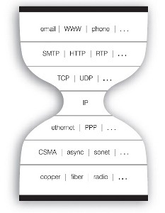
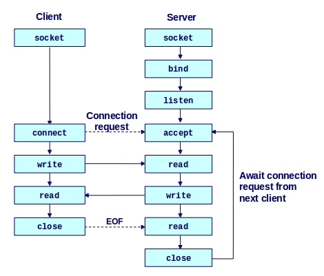

> "Мережа — це комп'ютер" (гасло корпорації Sun)

Підтримка роботи з мережею на перший погляд не є функцією ядра ОС, однак на практиці більшість ОС реалізують її в ядрі. Для цього є кілька причин:

- Робота з мережею потрібна переважній більшості нетривіальних програм, тому логічно, що ОС повинна надати для них мережевий сервіс, абстрагований від різнорідних апаратних засобів і низькорівневих протоколів підтримки з'єднання

> Будь-яка програма прагне розширитися до тих пір, поки з її допомогою не стане можливо читати пошту. Ті програми, які не розширюються настільки, замінюються тими, які розширюються. (Закон огортання софта Jamie Zawinski)

- Робота з мережею повинна бути швидкою
- Обмеження безпеки, пов'язані з роботою з мережею
- Відносна простота реалізації: невеликий набір стандартних протоколів, серед яких основні — це IP, TCP і UDP

Також в основі реализації комп'ютерних мереж лежить Принцип стійкості (Закон Постела):

> Будьте консервативним у тому, що відправляєте, і ліберальним у тому, що приймаєте від інших.

### "Хибні" уявлення програмістів про мережу

Розробка розподілених програм, що використовують мережу, відрізняється від розробки програм, що працюють на одному комп'ютері. Ці відмінності виражені в наступному списку т.зв. "оман" програмістів про мережу:

- Мережа надійна
- Витрати на транспорт нульові
- Затримка нульова
- Годинники синхронізувати
- Пропускна здатність необмежена
- Топологія мережі незмінна
- Мережа гомогенна
- Є тільки один адміністратор
- Мережа безпечна

## Модель OSI

[Мережева модель OSI](http://ru.wikipedia.org/wiki/%D0%A1%D0%B5%D1%82%D0%B5%D0%B2%D0%B0%D1%8F_%D0%BC%D0%BE%D0%B4%D0%B5%D0%BB%D1%8C_OSI) — це теоретична еталонна модель мережевої взаємодії відкритих систем. У ній реалізований принцип поділу турбот (separation of concerns), який виражений в тому, що взаємодія відбувається на 7 різних рівнях, кожен із яких відповідає за вирішення однієї проблеми:

- 7й - Прикладний (application) — доступ до мережних служб для прикладних додатків, дані представляються у вигляді "запитів" (requests)
- 6й - Представлення (presentation) — кодування і шифрування даних
- 5й - Сеансовий (session) — управління сеансом зв'язку
- 4й - Транспортний (transport) — зв'язок між кінцевими пунктами (які не обов'язково пов'язані безпосередньо) і надійність, дані представляються у вигляді "сегментів" (datagrams)
- 3й - Мережевий (network) — визначення маршруту і логічна адресація, забезпечення зв'язку в рамках мережі, дані представляються у вигляді "пакетів" (packets)
- 2й - Канальний (data link) — фізична адресація, забезпечення зв'язку точка-точка, дані представляються у вигляді "кадрів" (frames)
- 1й - Фізичний (physical) — робота із середовищем передачі, сигналами та двійковими даними (бітами)

При забезпеченні зв'язку між вузлами (хостами) дані проходять процес "занурення" з прикладного рівня на фізичний на відправнику і зворотний процес на одержувачу.

:br

## Стек протоколів TCP/IP

На практиці домінуючою моделлю мережевої взаємодії є стек протоколів TCP/IP, який в цілому відповідає моделі OSI, однак не регламентує обов'язкову наявність усіх рівнів в ній. Як випливає з назви, обов'язковими протоколами в ній є TCP (або його альтернатива UDP), а також IP, які реалізують транспортний і мережевий рівень моделі OSI.

Рівні TCP/IP стека:

- 4й - Прикладний рівень (Process/Application) — відповідає трьом верхнім рівням моделі OSI (проте, не обов'язково реалізує функціональність їх всіх)
- 3й - Транспортний рівень (Transport) — відповідає транспортному рівню моделі OSI
- 2й - Міжмережевий рівень (Internet) — відповідає мережному рівню моделі OSI
- 1й - Рівень мережевого доступу (Network Access) — відповідає двом нижнім рівням моделі OSI

У цій моделі верхній і нижній рівні включають в себе декілька рівнів моделі OSI і в різних випадках вони можуть бути реалізовані як одним протоколом взаємодії, так і декількома (відповідними окремим рівням). Наприклад, протокол HTTP реалізує рівні прикладної та представлення, а протокол TLS — сеансовий і представлення, а в поєднанні між собою вони можуть покрити всі 3 верхніх рівня. При цьому протокол HTTP працює і самостійно, і в цьому випадку, оскільки він не реалізує сеансовий рівень, HTTP-з'єднання називають "stateless", тобто не мають стану.

Модель TCP/IP також називають пісочним годинником, оскільки посередині в ній знаходиться один протокол, IP, а протоколи під ним і над ним є дуже різноманітними і покривають різні сценарії використання. Стандартизація протоколу посередині дає велику гнучкість низькорівневим протоколам (яка потрібна через наявність різних способів з'єднання) і високорівневим (потрібну через наявність різних сценаріїв роботи).

## Інтерфейс BSD сокетів

Інтерфейс сокетів — це де-факто стандарт взаємодії прикладної програми з ядром ОС — точка входу в мережу для додатка. Він з'єднує прикладний рівень стека TCP/IP, який реалізується в просторі користувача, з нижнім рівнями, які, як правило, реалізуються в ядрі ОС.

Сокети розраховані на роботу в клієнт-серверній парадигмі взаємодії: активний клієнт підключається до пасивного сервера, який здатний одночасно обробляти багато клієнтських з'єднань. Для ідентифікації сервера при сокетних з'єднанні використовується пара IP-адреса—порт. **Порт** — це унікальне в рамках одного хоста число, як правило, обмежене в діапазоні 1-65535. Порти деляться на привілейовані (1-1024), які виділяються для програм з дозволу адміністратора системи, і всі інші — доступні для будь-яких додатків без обмежень. Більшість стандартних прикладних протоколів мають стандартні номери портів: 80 — HTTP, 25 — SMTP, 22 — SSH, 21 — FTP, 53 — DNS. Один порт може одночасно використовувати тільки один процес ОС.

Сокет — це файлоподібний об'єкт, що підтримує наступні операції:

- Створення — в результаті у програми з'являється відповідний файловий дескриптор
- Підключення — виконується по-різному для клієнта і сервера
- Відключення
- Читання/запис
- Конфігурація

Основні системні виклики для роботи із сокетами:

- `socket` — створення сокета
- `connect` — ініціація клієнтського з'єднання
- `bind` — прив'язка сокета до порту
- `listen` — переведення сокета в пасивний режим прослуховування порту (актуально тільки для TCP з'єднань)
- `accept` — прийняття з'єднання від клієнта (який викликав операцію `connect`) — це блокуюча операци, яка чекає надходження нового з'єднання
- `read`/`write` або ж `send`/`recv` — читання/запис даних в сокет
- `recvfrom`/`sendto` — аналогічні операції для UDP сокетів
- `setsockopt` — установка параметрів сокета
- `close` — закриття сокета

Оскільки сокети — це, фактично, інтерфейс для занурення на третій рівень TCP/IP-стека, сокети не надають механізмів для управління кодуванням даних і сеансами роботи додатків — вони просто дозволяють передати "сирий" потік байт.

:br

### Загальна схема взаємодії через сокет

Як видно зі схеми, на сервері для встановлення TCP з'єднання потрібно виконати 3 операції:

- `bind` захоплює порт, після чого інші процеси не зможуть зайняти його для себе
- `listen` (для TCP з'єднання) переводить його в режим прослуховування, після чого клієнти можуть ініціювати підключення до нього
- однак, поки на сервері на виконаний `accept`, клієнтські з'єднання будуть чекати в черзі (backlog) сокета, обмеження на яку можуть бути задані у виклику `listen`

Виконання `accept` приводить до появи ще одного об'єкта сокета, який відповідає поточному клієнтському з'єднанню. При цьому серверний сокет може приймати нові з'єднання.

Після виконання `accept` сервер може реалізувати кілька сценаріїв обслуговування клієнта:

- ексклюзивний варіант — обслуговування відбувається в тому ж потоці, який виконав `accept`, тому інші клієнти чекають завершення з'єднання у черзі
- 1 потік на з'єднання — відразу ж після виконання `accept` створюється новий потік, куди передається новоутворений сокет, і подальша комунікація відбувається в цьому потоці, який закривається по завершенню з'єднання. Тим часом сервер може приймати нові з'єднання. Така схема є найбільш поширеною. Її основний недолік — це великі накладні витрати на кожне з'єднання (окремий потік ОС)
- неблокуюче введення-виведення — при цьому в одному потоці сервер приймає з'єднання, а в іншому потоці працює т.зв. цикл подій (event loop), в якому відбувається асинхронна обробка всіх прийнятих клієнтських з'єднань

### Неблокуюче (асинхронне) введення-виведення

Сокети підтримують як синхронне, так і асинхронне введення-виведення. Асинхронне IO є критичною функцією для створення ефективних мережевих серверів. Для підтримки асинхронного введення-виведення у сокетів (як і у інших файлових дескрипторів) є параметр `O_NONBLOCK`, який можна встановити за допомогою системного виклику `fcntl`. Після переведення файлового дескриптора в неблокуючий режим, з сокетом можна працювати за допомогою системних викликів `select` і `poll`, які дозволяють для групи файлових дескрипторів дізнатися, які з них готові до читання/запису. Альтернативою `poll` є специфічні для окремих систем операції, які реалізовані більш ефективно, але не є портабельними: `epoll` в Linux, `kqueue` у FreeBSD та ін.

### ZeroMQ (0MQ)

Розвитком парадигми сокетних з'єднань за рамки моделі взаємодії клієнт-сервер є технологія ZeroMQ, яка надає вдосконалений інтерфейс сокетів з підтримкою більшої кількості протоколів взаємодії, а також з підтримкою інших схем роботи:

- публікація-підписка (pub-sub)
- тягни-штовхай (push-pull)
- дилер-маршрутизатор (dealer-router)
- екскюзівная пара
- і нарешті, схема запит-відповідь (req-rep) — це класична клієнт-серверна схема з'єднання

Див. [ZeroMQ - Super Sockets](http://www.slideshare.net/j2d2/zeromq-super-sockets-by-j2-labs)

## RPC і мережеві архітектури

Розподілена програма використовує для взаємодії певний протокол, який також можна розглядати як інтерфейс виклику процедур віддалено (RPC — remote procedure call). Фактично, інтерфейс RPC реалізує прикладний рівень моделі OSI, але для його підтримки також необхідно в тій чи іншій мірі реалізувати протоколи рівня представлення і, іноді, сеансового рівня. Рівень представлення вирішує задачу передачі даних в рамках гетерогенної (тобто складеної з різних компонент) мережі в "зрозумілій" формі. Для цього потрібно враховувати такі аспекти, як старшинство байт (endianness), кодування для текстових даних, подання композитних даних (колекцій, структур) і т.д. Ще одним завданням RPC-рівня часто є знаходження сервісів (service discovery).

Реалізація RPC може бути заснована на власному (ad hoc) або ж якомусь із стандартних протоколів прикладного рівня і представлення. Наприклад, реалізація RPC по методолгіі REST використовує стандартні протоколи HTTP в якості транспортного і JSON/XML для представлення (сериалізації). XML/RPC або JSON/RPC — це ad hoc RPC, які використовує XML або JSON для представлення даних. Протоколи ASN.1 і Thrift — це бінарні протоколи, які визначають реалізацію всіх 3-х рівнів.

У форматів серіалізації існує 2 дихотомії: бінарні і текстові формати, а також статичні (що використовують схему) і динамічні (без схеми, schema-less).

Поширені формати серіалізації включають:

- JSON — текстовий динамічний формат
- XML — тестовий формат з опціональною схемою 
- Protocol Buffers — бінарний статичний формат
- MessagePack — заснований на JSON бінарний формат
- Avro — заснований на JSON формат зі схемою
- EDN (extensible data notation) — текстовий динамічний формат

Мережеві програми можуть бути реалізовані у вигляді різних мережевих архітектур. Ключовим параметром для кожної архітектури є рівень централізації: від повністю централізованих — **клієнт-сервер** — до повністю децентралізованих — **peer-to-peer**/**P2P**. Важливими моделями між цими двома крайнощами є модель сервісно-орієнтованої архітектури (**SOA**), а також модель **клієнт-черга-клієнт**.

## Література

- [Tour of the Black Holes of Computing: Network Programming](http://www.cs.hmc.edu/~geoff/classes/hmc.cs105.200809/slides/class23_net2.ppt)
- [Beej's Guide to Network Programming](http://beej.us/guide/bgnet/output/html/singlepage/bgnet.html)
- [Socket System Calls](http://www.slideshare.net/AvinashVarma/socket-system-calls)
- [How TCP backlog works in Linux](http://veithen.github.io/2014/01/01/how-tcp-backlog-works-in-linux.html)
- [TCP in 30 instructions ](http://www.pdl.cmu.edu/mailinglists/ips/mail/msg00133.html)
- [Мультиплексирование ввода-вывода](http://ro-che.info/docs/2011-11-29-io-multiplexing.pdf)
